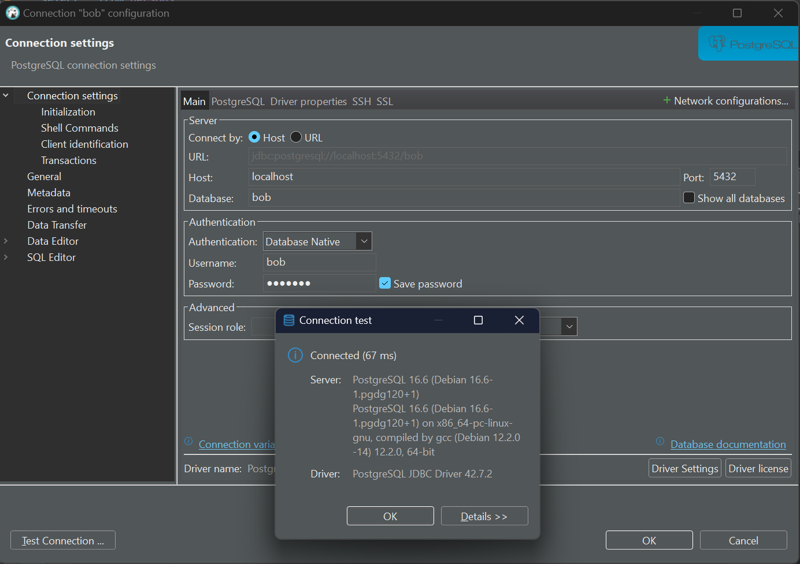
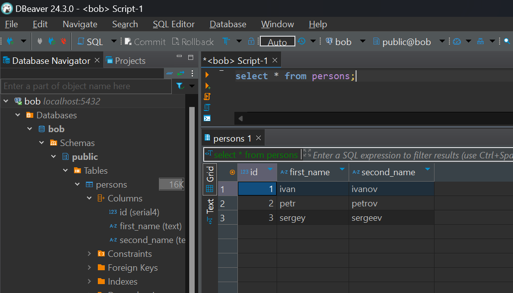

# Домашнее задание
## Установка и настройка PostgteSQL в контейнере Docker
 
 ### Docker на хосте с ОС семейства Windows

Скачиваем дистрибутив "Docker Desktop Installer.exe" с [официального сайта](https://www.docker.com/) устанавливаем Docker и запускаем.


Загружаем образ PostgreSQL из репозитория [Docker Hub](https://hub.docker.com/_/postgres), по умолчанию загружается последняя стабильная версия, но мы будем скачивать версию 16.6

```bash
docker pull postgres:16.6
  16.6: Pulling from library/postgres
  bc0965b23a04: Pull complete
  ...
  74514b099210: Pull complete
  Digest: sha256:5620f242bbc0e17478556102327e7efcf60ab48de3607c9e0ea98800841785ec
  Status: Downloaded newer image for postgres:16.6
  docker.io/library/postgres:16.6
```

Создаем новую сеть Docker`а

```bash
docker network create bob-pg-net
  7c14200da4f7de3b272cd03aaac2bb14c88e65a3aacf309945887d7979a1db65
docker network list
  NETWORK ID     NAME         DRIVER    SCOPE
  7c14200da4f7   bob-pg-net   bridge    local
  b9504d06c09e   bridge       bridge    local
  0fb32ce5a8fb   host         host      local
  7fe20835ce60   none         null      local
```

Создадим и запусти новый контейнер, используя образ postgres:16.6, подключим его к сети bob-pg-net. В командах используются следующие опции:
|||
|----|----|
|`--name`|Присвоить заданное имя контейнеру|
|`--network`|Подключить контейнер к указанной сети|
|`-e, --env`|Установить переменные среды|
|`-d, --detach`|Запустить контейнер в фоновом режиме и вывести идентификатор контейнера|
|`-p, --publish`|Опубликовать (прокинуть) порты контейнера на хосте|
|`-v, --volume`|Привязать и смонтировать файл/каталог|
|`-it`|Запустить контейнер в интерактивном режиме == -i -t|
|`-i, --interactive`|Оставлять стандартный поток ввода (STDIN) открытым, даже если он не подключен. Позволяет перенаправлять ввод в контейнер через стандартный ввод. Чаще всего используется вместе с флагом --tty для привязки потоков ввода-вывода контейнера к псевдотерминалу, создавая интерактивный сеанс терминала для контейнера.|
|`-t, --tty`|Выделить псевдо терминал (TTY). Присоединяет псевдо-TTY к контейнеру, подключая терминал хоста к потокам ввода-вывода контейнера.|
|`--rm`|Автоматически удалять контейнер и связанные с ним анонимные тома при выходе|

и переменные среды:
||||
|-|-|-|
|`POSTGRES_PASSWORD`|Обязательная|Задает пароль суперпользователя для PostgreSQL. Суперпользователь по умолчанию определяется переменной среды POSTGRES_USE|
|`POSTGRES_USER`|Не обязательная|Используется вместе с POSTGRES_PASSWORD. Задает имя суперпользователя и имя дефолтной базы данных, которые будут созданы при первом запуске образа. Если переменная не задана, то будет использоваться пользователь по умолчанию postgres.|

Создаем и запускаем контейнер с сервером БД:

```bash
docker run ^
  --name bob-pg-srv ^
  --network bob-pg-net ^
  -e POSTGRES_USER=bob ^
  -e POSTGRES_PASSWORD=1Qwerty ^
  -d ^
  -p 5432:5432 ^
  -v %USERPROFILE%/.docker-pg-data:/var/lib/postgresql/data postgres:16.6

4670f88ac9498dd958fe2c067396a9f19c96f4a7e7a7eeb1ea1bcf471f999a89

docker container list --filter status=running

CONTAINER ID   IMAGE           COMMAND                  CREATED          STATUS          PORTS                    NAMES
4670f88ac949   postgres:16.6   "docker-entrypoint.s…"   13 seconds ago   Up 12 seconds   0.0.0.0:5432->5432/tcp   bob-pg-srv
```

Создадим и запустим контейнер с клиентом, подключим его к той же сети bob-pg-net что и сервер:

```bash
docker run ^
  -it ^
  --rm ^
  --network bob-pg-net ^
  --name bob-pg-cli ^
  postgres:16.6 ^
  psql -h bob-pg-srv -U bob

Password for user bob:
psql (16.6 (Debian 16.6-1.pgdg120+1))
Type "help" for help.

bob=# \dt
  Did not find any relations.
```

Создадим тестовую таблицу и добавим в нее данные.

```bash
CREATE TABLE persons(id serial, first_name text, second_name text);
  CREATE TABLE
INSERT INTO persons(first_name, second_name) VALUES('ivan', 'ivanov'), ('petr', 'petrov'), ('sergey', 'sergeev');
  INSERT 0 3
SELECT * FROM persons;
 id | first_name | second_name
----+------------+-------------
  1 | ivan       | ivanov
  2 | petr       | petrov
  3 | sergey     | sergeev
(3 rows)
```

Подключимся к контейнеру с сервером БД из DBeaver. Для чего в GUI DBeaver жмем "Ctrl+Shift+N", выбираем БД = PostgreSQL и в окне "Connection Settings" задаем следующие параметры:
|||
|-|-|
|Host:| localhost
|Database:| bob
|Username:| bob
|Password:| 1Qwerty

Проверяем соединение поп кнопке "Test Connection..."



Получим выборку из нашей тестовой таблицы:



Подключение работает.

Теперь выйдем из клиента:

```bash
# Терминал Windows
docker container list --filter status=running
CONTAINER ID   IMAGE           COMMAND                  CREATED          STATUS          PORTS                    NAMES
4d2e60225822   postgres:16.6   "docker-entrypoint.s…"   39 seconds ago   Up 36 seconds   5432/tcp                 bob-pg-cli
4670f88ac949   postgres:16.6   "docker-entrypoint.s…"   3 hours ago      Up 2 hours      0.0.0.0:5432->5432/tcp   bob-pg-srv

# В терминале с psql вводим
\q

docker container list --filter status=running
CONTAINER ID   IMAGE           COMMAND                  CREATED       STATUS       PORTS                    NAMES
4670f88ac949   postgres:16.6   "docker-entrypoint.s…"   3 hours ago   Up 3 hours   0.0.0.0:5432->5432/tcp   bob-pg-srv
```

Остановим и удалим контейнер с сервером БД:

```bash
docker container stop bob-pg-srv
  bob-pg-srv
docker container remove bob-pg-srv
  bob-pg-srv
docker container list --all
  CONTAINER ID   IMAGE     COMMAND   CREATED       STATUS                     PORTS     NAMES
  7b2c9f318bb1   ubuntu    "bash"    6 weeks ago   Exited (255) 6 weeks ago             ubuntu24
```

Установим контейнер с сервером заново:

```bash
docker run ^
  --name bob-pg-srv ^
  --network bob-pg-net ^
  -e POSTGRES_USER=bob ^
  -e POSTGRES_PASSWORD=1Qwerty ^
  -d ^
  -p 5432:5432 ^
  -v %USERPROFILE%/.docker-pg-data:/var/lib/postgresql/data postgres:16.6
0e05ad7821d880e950d2d5d09362cedb84c70de7fd685c45c42aeb161af5be54

docker container list --all
  CONTAINER ID   IMAGE           COMMAND                  CREATED          STATUS                     PORTS                    NAMES
  0e05ad7821d8   postgres:16.6   "docker-entrypoint.s…"   11 seconds ago   Up 11 seconds              0.0.0.0:5432->5432/tcp   bob-pg-srv
  7b2c9f318bb1   ubuntu          "bash"                   6 weeks ago      Exited (255) 6 weeks ago                            ubuntu24
```

Подключимся к контейнеру с сервером клиентом и убедимся, что данные остались на месте:

```bash
docker run ^
  -it ^
  --rm ^
  --network bob-pg-net ^
  --name bob-pg-cli ^
  postgres:16.6 ^
  psql -h bob-pg-srv -U bob
Password for user bob:
psql (16.6 (Debian 16.6-1.pgdg120+1))
Type "help" for help.
bob=# \dt
         List of relations
 Schema |   Name   | Type  | Owner
--------+----------+-------+-------
 public | persons  | table | bob
(1 rows)

bob=# SELECT * FROM persons;
 id | first_name | second_name
----+------------+-------------
  1 | ivan       | ivanov
  2 | petr       | petrov
  3 | sergey     | sergeev
(3 rows)
```

Данные остались на месте благодаря тому, что мы смонтировали папку хоста в контейнер с сервером. Если же мы создадим контейнер с сервером без связывания монтированием (без опции -v), то в случае остановки такого контейнера и последующего его перезапуска, данные останутся на месте, а в случае удаления его - данные удалятся вместе с контейнером.

```bash
# Остановим и удалим контейнер с Сервером БД
docker container stop bob-pg-srv
  bob-pg-srv
docker container remove bob-pg-srv
  bob-pg-srv

# Заново создадим и запустим контейнер Сервера БД без привязки монтированием
docker run --name bob-pg-srv --network bob-pg-net -e POSTGRES_USER=bob -e POSTGRES_PASSWORD=1Qwerty -d -p 5432:5432 postgres:16.6

b50c0843d90c143e6b7769a1947631d73eb4716c7bd3a2744e565d5ba41775ea

# Подключимся к контейнеру с Сервером
docker run -it --rm --network bob-pg-net --name bob-pg-cli postgres:16.6 psql -h bob-pg-srv -U bob

Password for user bob:
psql (16.6 (Debian 16.6-1.pgdg120+1))
Type "help" for help.

# Получим список всех таблиц БД bob
\dt
Did not find any relations.

# Создадим тестовую таблицу
CREATE TABLE persons(id serial, first_name text, second_name text);
CREATE TABLE

# Наполним ее данными
INSERT INTO persons(first_name, second_name) VALUES('ivan', 'ivanov'), ('petr', 'petrov'), ('sergey', 'sergeev');
INSERT 0 3

# Получим список всех таблиц БД bob
\dt
        List of relations
 Schema |  Name   | Type  | Owner
--------+---------+-------+-------
 public | persons | table | bob
(1 row)

# Содержимое таблицы persons
SELECT * FROM persons;
 id | first_name | second_name
----+------------+-------------
  1 | ivan       | ivanov
  2 | petr       | petrov
  3 | sergey     | sergeev
(3 rows)

# Выйдем из psql
\q

# Остановим контейнер с сервером
docker container stop bob-pg-srv
  bob-pg-srv

docker container list --all
CONTAINER ID   IMAGE           COMMAND                  CREATED          STATUS                     PORTS     NAMES
b50c0843d90c   postgres:16.6   "docker-entrypoint.s…"   16 minutes ago   Exited (0) 4 seconds ago             bob-pg-srv
7b2c9f318bb1   ubuntu          "bash"                   7 weeks ago      Exited (255) 7 weeks ago             ubuntu24

# Снова запустим контейнер с Сервером БД
docker container start bob-pg-srv
bob-pg-srv

# Подключимся к нему клиентом
docker run -it --rm --network bob-pg-net --name bob-pg-cli postgres:16.6 psql -h bob-pg-srv -U bob
Password for user bob:
psql (16.6 (Debian 16.6-1.pgdg120+1))
Type "help" for help.

# Проверим, что данные на месте
\dt
        List of relations
 Schema |  Name   | Type  | Owner
--------+---------+-------+-------
 public | persons | table | bob
(1 row)

SELECT * FROM persons;
 id | first_name | second_name
----+------------+-------------
  1 | ivan       | ivanov
  2 | petr       | petrov
  3 | sergey     | sergeev
(3 rows)

# Отсутствие данных после остановки и удаления контенера с Сервером БД, уже было продемонстрировано ранее, в самом начале этого блока кода.

```


