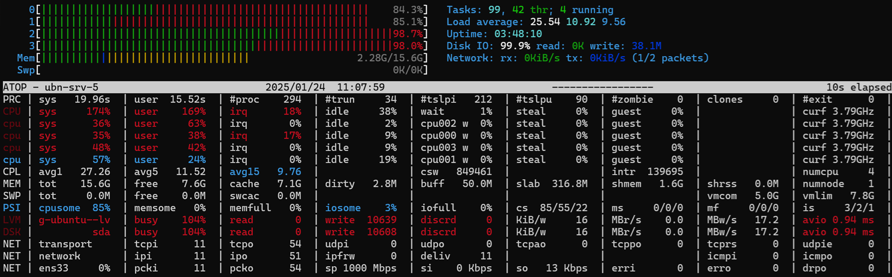

# Домашнее задание
## Нагрузочное тестирование и тюнинг PostgreSQL
 
Разворачиваем новый кластер PostgreSQL 16 на Ubuntu 22.04 LTS в WMware. Виртуальная машина будет состоять из 1 го процессора с 4 ядрами, 16Гб ОЗУ и 40Гб SSD диска.

Тестирование производительности будем производить штатным тестом pgbench, мониторить ресурсы будем при помощи htop и atop.

Для запускаемого дефолтного теста pgbench типа TPC-B нужно предварительно подготовить определённые таблицы (выполнить инициализацию). Будем использовать следующие параметры

|||
|-|-|
|-i|Требуется для вызова режима инициализации.|
|-s коэффициент_масштаба|Умножить число генерируемых строк на заданный коэффициент.|
|||

Начальный коэффициент масштаба -s должен быть не меньше числа клиентов, с каким будем проводить тестирование; в противном случае мы, по большому счёту, будете замерять время конкурентных изменений. Таблица pgbench_branches содержит всего -s строк, а каждая транзакция хочет изменить одну из них, так что если число соединений превышает -s, это несомненно приведёт к тому, что многие транзакции будут блокироваться другими.

```bash
sudo -u postgres pgbench -i -s 100
[sudo] password for sa5:
dropping old tables...
NOTICE:  table "pgbench_accounts" does not exist, skipping
NOTICE:  table "pgbench_branches" does not exist, skipping
NOTICE:  table "pgbench_history" does not exist, skipping
NOTICE:  table "pgbench_tellers" does not exist, skipping
creating tables...
generating data (client-side)...
10000000 of 10000000 tuples (100%) done (elapsed 16.73 s, remaining 0.00 s)
vacuuming...
creating primary keys...
done in 21.23 s (drop tables 0.00 s, create tables 0.00 s, client-side generate 17.06 s, vacuum 0.21 s, primary keys 3.95 s).

# Посмотрим что создалось
# В консоли psql
SELECT relname, oid, relfilenode, relnamespace, pg_size_pretty(pg_relation_size(oid)) AS table_size, regexp_replace(reltuples::bigint::text, '(?<=\d)(?<!\.[^.]*)(?=(\d\d\d)+(?!\d))', ' ', 'g') AS rows_estimate_count FROM pg_class WHERE relkind='r' AND relname LIKE 'pgbench_%';
     relname      |  oid  | relfilenode | relnamespace | table_size | rows_estimate_count
------------------+-------+-------------+--------------+------------+---------------------
 pgbench_accounts | 16394 |       16400 |         2200 | 1298 MB    | 10 000 000
 pgbench_branches | 16397 |       16401 |         2200 | 16 kB      | 100
 pgbench_history  | 16388 |       16414 |         2200 | 4952 kB    | 89 270
 pgbench_tellers  | 16391 |       16403 |         2200 | 72 kB      | 1 000
(4 rows)
```

Для тестирования производительности будем использовать следующие параметры:

|||
|-|-|
|`-T секунды`|Выполнять тест с ограничением по времени (в секундах), а не по числу транзакций для каждого клиента.|
|`-c клиенты`|Число имитируемых клиентов, то есть число одновременных сеансов базы данных. Значение по умолчанию — 1.|
|`-j потоки`|Число рабочих потоков в pgbench. Использовать нескольких потоков может быть полезно на многопроцессорных компьютерах. Клиенты распределяются по доступным потокам равномерно, насколько это возможно. Значение по умолчанию — 1.|
|`-P секунды`|Выводить отчёт о прогрессе через заданное число секунд (сек). Выдаваемый отчёт включает время, прошедшее с момента запуска, скорость (в TPS) с момента предыдущего отчёта, а также среднее время ожидания транзакций, стандартное отклонение и количество неуспешных транзакций с момента последнего отчёта.|

Протестируем кластер на дефолтном конфиге. Запустим тест в одного клиента на 120 секунд:
```bash
sudo -u postgres pgbench -P 30 -c 1 -j 1 -T 120
pgbench (16.6 (Ubuntu 16.6-1.pgdg22.04+1))
starting vacuum...end.
progress: 30.0 s, 663.6 tps, lat 1.506 ms stddev 0.464, 0 failed
progress: 60.0 s, 649.4 tps, lat 1.540 ms stddev 0.496, 0 failed
progress: 90.0 s, 656.5 tps, lat 1.523 ms stddev 0.513, 0 failed
progress: 120.0 s, 612.8 tps, lat 1.631 ms stddev 0.671, 0 failed
transaction type: <builtin: TPC-B (sort of)>
scaling factor: 100
query mode: simple
number of clients: 1
number of threads: 1
maximum number of tries: 1
duration: 120 s
number of transactions actually processed: 77470
number of failed transactions: 0 (0.000%)
latency average = 1.549 ms
latency stddev = 0.541 ms
initial connection time = 3.153 ms
tps = 645.597386 (without initial connection time)
```


Производительность не очень высокая, даже до 1000tps не дотянули и упираемся в производительность дисковой подсистемы.

Запустим тест для 10 клиентов на 120 секунд:
```bash
sudo -u postgres pgbench -P 30 -c 10 -j 1 -T 120
[sudo] password for sa5:
pgbench (16.6 (Ubuntu 16.6-1.pgdg22.04+1))
starting vacuum...end.
progress: 30.0 s, 4823.1 tps, lat 2.053 ms stddev 0.958, 0 failed
progress: 60.0 s, 4166.7 tps, lat 2.381 ms stddev 1.816, 0 failed
progress: 90.0 s, 4081.0 tps, lat 2.431 ms stddev 1.831, 0 failed
progress: 120.0 s, 4132.4 tps, lat 2.400 ms stddev 1.545, 0 failed
transaction type: <builtin: TPC-B (sort of)>
scaling factor: 100
query mode: simple
number of clients: 10
number of threads: 1
maximum number of tries: 1
duration: 120 s
number of transactions actually processed: 516106
number of failed transactions: 0 (0.000%)
latency average = 2.306 ms
latency stddev = 1.566 ms
initial connection time = 29.205 ms
tps = 4301.180186 (without initial connection time)
```


Производительность подросла, поднагрузились ядра процессора, но по-прежнему упираемся в дисковую подсистему, память недогружена.

Запустим тест для 10 клиентов в 4 потока на 120 секунд:

```bash
sudo -u postgres pgbench -P 30 -c 10 -j 4 -T 120
[sudo] password for sa5:
pgbench (16.6 (Ubuntu 16.6-1.pgdg22.04+1))
starting vacuum...end.
progress: 30.0 s, 4879.8 tps, lat 2.046 ms stddev 1.324, 0 failed
progress: 60.0 s, 4927.8 tps, lat 2.028 ms stddev 1.668, 0 failed
progress: 90.0 s, 4598.0 tps, lat 2.173 ms stddev 1.993, 0 failed
progress: 120.0 s, 4863.7 tps, lat 2.055 ms stddev 1.931, 0 failed
transaction type: <builtin: TPC-B (sort of)>
scaling factor: 100
query mode: simple
number of clients: 10
number of threads: 4
maximum number of tries: 1
duration: 120 s
number of transactions actually processed: 578088
number of failed transactions: 0 (0.000%)
latency average = 2.074 ms
latency stddev = 1.746 ms
initial connection time = 7.976 ms
tps = 4817.238743 (without initial connection time)
```


Производительность чуть подросла, и чуть поднагрузились ядра процессора, но по-прежнему упираемся в дисковую подсистему, память недогружена.

Увеличим число клиентов до 20.

```bash
 sudo -u postgres pgbench -P 30 -c 20 -j 4 -T 120
pgbench (16.6 (Ubuntu 16.6-1.pgdg22.04+1))
starting vacuum...end.
progress: 30.0 s, 5428.9 tps, lat 3.676 ms stddev 2.806, 0 failed
progress: 60.0 s, 4717.8 tps, lat 4.234 ms stddev 3.524, 0 failed
progress: 90.0 s, 4698.4 tps, lat 4.251 ms stddev 3.469, 0 failed
progress: 120.0 s, 5169.2 tps, lat 3.864 ms stddev 3.209, 0 failed
transaction type: <builtin: TPC-B (sort of)>
scaling factor: 100
query mode: simple
number of clients: 20
number of threads: 4
maximum number of tries: 1
duration: 120 s
number of transactions actually processed: 600446
number of failed transactions: 0 (0.000%)
latency average = 3.991 ms
latency stddev = 3.257 ms
initial connection time = 17.813 ms
tps = 5003.294347 (without initial connection time)
```

Результат чуть лучше предыдущего.

Попробуем поиграться с настройками PostgreSQL. Воспользуемся калькулятором pgtune.leopard.in.ua. Из документации на PostgreSQL видно, что стандартный тест pgbench дает нагрузку следующего вида:
```bash
BEGIN;
UPDATE pgbench_accounts SET abalance = abalance + :delta WHERE aid = :aid;
SELECT abalance FROM pgbench_accounts WHERE aid = :aid;
UPDATE pgbench_tellers SET tbalance = tbalance + :delta WHERE tid = :tid;
UPDATE pgbench_branches SET bbalance = bbalance + :delta WHERE bid = :bid;
INSERT INTO pgbench_history (tid, bid, aid, delta, mtime) VALUES
(:tid, :bid, :aid, :delta, CURRENT_TIMESTAMP);
END;
``` 
Внутри одной транзакции 5 команд и 4 из них являются запросами на изменение/добавление данных. То есть 80% пишущая нагрузка в то время, как обычно, все наоборот, 70-90% чтение, а остальное изменение, добавление и удаление. PostgreSQL использует MVCC и не очень "любит" изменение данных из-за повышенной дисковой нагрузки, так же частые изменения приводят к фрагментированию данных, накоплению неактуальных строк и «мёртвого» пространства в таблицах, что в свою очередь влияет на результаты теста. Конечно же, зная это, желательно перед каждым тестом проводить новую инициализацию и отключить автоочистку, во избежания неадекватных результатов. Перед каждым следующим тестом мы будем проводить инициализацию заново.

 Для того, чтобы воспользоваться калькулятором, нам, помимо параметров самой машины, нужно знать еще и тип нагрузки. Решим задачу от обратного. Определим какому типу нагрузки, соответствует стандартная нагрузка pgbench. Для чего произведем нагрузочное тестирование с параметрами настройки, рассчитанными калькулятором, для разных типов нагрузки. Результат сведем в таблицу.

 Так же, добавим в таблицу объем рекомендуемой памяти сервера, рассчитанный по формуле:

ОЗУ > 2Gb + shared_buffers + max_connections * (work_mem + temp_buffers) + max_parallel_maintenance_workers * maintenance_work_mem

 Исходные данные для расчета на клькуляторе:
 - DB Version: 16
 - OS Type: linux
 - DB Type: Попробуем все 5 типов
 - Total Memory (RAM): 16 GB
 - CPUs num: 4
 - Connections num: 20
 - Data Storage: ssd
 
||||||||
|-|-|-|-|-|-|-|
|параметр|default|web|oltp|dw|desktop|mixed|
|max_connections|100|20|20|20|20|20|
|shared_buffers|128MB|4GB|4GB|4GB|1GB|4GB|
|effective_cache_size|4GB|12GB|12GB|12GB|4GB|12GB|
|maintenance_work_mem|64MB|1GB|1GB|2GB|1GB|1GB|
|checkpoint_completion_target|0,9|0.9|0.9|0.9|0.9|0.9|
|wal_buffers|4MB|16MB|16MB|16MB|16MB|16MB|
|default_statistics_target|100|100|100|500|100|100|
|random_page_cost|4|1.1|1.1|1.1|1.1|1.1|
|effective_io_concurrency|1|200|200|200|200|200|
|work_mem|4MB|104857kB|104857kB|52428kB|21845kB|52428kB|
|huge_pages|try|off|off|off|off|off|
|min_wal_size|80MB|1GB|2GB|4GB|100MB|1GB|
|max_wal_size|1GB|4GB|8GB|16GB|2GB|4GB|
|max_worker_processes|8|4|4|4|4|4|
|max_parallel_workers_per_gather|2|2|2|2|2|2|
|max_parallel_workers|8|4|4|4|4|4|
|max_parallel_maintenance_workers|2|2|2|2|2|2|
|wal_level|replica|replica|replica|replica|minimal|replica|
|max_wal_senders|10|10|10|10|0|10|
|ОЗУ >|3,4GB|10,2GB|10,2GB|11,2GB|5,6GB|9,2GB|
|результаты|||||||
|tps|5003|5521|5940|5931|5071|5578|

По результатам тестов, видно, что данная нагрузка, генерируемая стандартным тестом pgbanch, более коррелирует с параметрами для нагрузки по типу OLTP или Data warehouse.

И так, для параметров рассчитанных для OLTP имеем следующую картину:

```bash
sudo -u postgres pgbench -P 30 -c 20 -j 4 -T 120
pgbench (16.6 (Ubuntu 16.6-1.pgdg22.04+1))
starting vacuum...end.
progress: 30.0 s, 5696.6 tps, lat 3.503 ms stddev 1.493, 0 failed
progress: 60.0 s, 6035.1 tps, lat 3.309 ms stddev 1.371, 0 failed
progress: 90.0 s, 5433.3 tps, lat 3.676 ms stddev 1.717, 0 failed
progress: 120.0 s, 5723.9 tps, lat 3.489 ms stddev 1.562, 0 failed
transaction type: <builtin: TPC-B (sort of)>
scaling factor: 100
query mode: simple
number of clients: 20
number of threads: 4
maximum number of tries: 1
duration: 120 s
number of transactions actually processed: 686692
number of failed transactions: 0 (0.000%)
latency average = 3.490 ms
latency stddev = 1.543 ms
initial connection time = 20.513 ms
tps = 5721.701289 (without initial connection time)
```


Диск пашет во всю, процессор на 80%, а память процентов на 15%. Подправим max_connections=100 и протестируем еще раз для 50 соединений (половинная нагрузка):
```bash
sudo -u postgres pgbench -P 30 -c 50 -j 4 -T 120
pgbench (16.6 (Ubuntu 16.6-1.pgdg22.04+1))
starting vacuum...end.
progress: 30.0 s, 5503.3 tps, lat 9.066 ms stddev 4.808, 0 failed
progress: 60.0 s, 5897.2 tps, lat 8.473 ms stddev 4.116, 0 failed
progress: 90.0 s, 5254.5 tps, lat 9.511 ms stddev 4.860, 0 failed
progress: 120.0 s, 5532.5 tps, lat 9.032 ms stddev 4.763, 0 failed
transaction type: <builtin: TPC-B (sort of)>
scaling factor: 100
query mode: simple
number of clients: 50
number of threads: 4
maximum number of tries: 1
duration: 120 s
number of transactions actually processed: 665668
number of failed transactions: 0 (0.000%)
latency average = 9.007 ms
latency stddev = 4.656 ms
initial connection time = 42.195 ms
tps = 5546.273828 (without initial connection time)
```


и для 100 клиентов (полная нагрузка):
```bash
sudo -u postgres pgbench -P 30 -c 100 -j 4 -T 120
pgbench (16.6 (Ubuntu 16.6-1.pgdg22.04+1))
starting vacuum...end.
progress: 30.0 s, 4635.6 tps, lat 21.497 ms stddev 14.124, 0 failed
progress: 60.0 s, 4671.1 tps, lat 21.397 ms stddev 13.599, 0 failed
progress: 90.0 s, 4709.2 tps, lat 21.242 ms stddev 14.319, 0 failed
progress: 120.0 s, 4785.7 tps, lat 20.884 ms stddev 13.075, 0 failed
transaction type: <builtin: TPC-B (sort of)>
scaling factor: 100
query mode: simple
number of clients: 100
number of threads: 4
maximum number of tries: 1
duration: 120 s
number of transactions actually processed: 564144
number of failed transactions: 0 (0.000%)
latency average = 21.266 ms
latency stddev = 13.845 ms
initial connection time = 87.738 ms
tps = 4696.644802 (without initial connection time)
```


Производительность в tps просаживается с ростом числа клиентов, память по-прежнему используется процентов на 15%, поднагрузился проц и чуть упала нагрузка на диск.

Наверное, размер БД слишком маленький, чтобы по полному задействовать память в данной конфигурации ВМ. 

```bash
 \l+
List of databases
-[ RECORD 1 ]-----+-------------------------------------------
Name              | postgres
Owner             | postgres
Encoding          | UTF8
Locale Provider   | libc
Collate           | en_US.UTF-8
Ctype             | en_US.UTF-8
ICU Locale        |
ICU Rules         |
Access privileges |
Size              | 1554 MB
Tablespace        | pg_default
Description       | default administrative connection database

SELECT relname, oid, relfilenode, relnamespace, pg_size_pretty(pg_relation_size(oid)) AS table_size, regexp_replace(reltuples::bigint::text, '(?<=\d)(?<!\.[^.]*)(?=(\d\d\d)+(?!\d))', ' ', 'g') AS rows_estimate_count FROM pg_class WHERE relkind='r' AND relname LIKE 'pgbench_%';
     relname      |  oid  | relfilenode | relnamespace | table_size | rows_estimate_count
------------------+-------+-------------+--------------+------------+---------------------
 pgbench_accounts | 16548 |       16554 |         2200 | 1302 MB    | 10 000 000
 pgbench_branches | 16551 |       16555 |         2200 | 440 kB     | 100
 pgbench_tellers  | 16545 |       16557 |         2200 | 608 kB     | 1 000
 pgbench_history  | 16542 |       16565 |         2200 | 29 MB      | 564 144
(4 rows)
```

Создадим новую тестовую БД и переинициализируем ее с коэффициент масштаба 300

```bash
# В консоли psql
CREATE DATABASE testbench;
CREATE DATABASE

# В консоли
sudo -u postgres pgbench -i -s 300 testbench
dropping old tables...
creating tables...
generating data (client-side)...
30000000 of 30000000 tuples (100%) done (elapsed 16.49 s, remaining 0.00 s)
vacuuming...
creating primary keys...
done in 23.87 s (drop tables 0.58 s, create tables 0.01 s, client-side generate 16.90 s, vacuum 0.15 s, primary keys 6.23 s).

# В консоли psql
\l+
-[ RECORD 4 ]-----+-------------------------------------------
Name              | testbench
Owner             | postgres
Encoding          | UTF8
Locale Provider   | libc
Collate           | en_US.UTF-8
Ctype             | en_US.UTF-8
ICU Locale        |
ICU Rules         |
Access privileges |
Size              | 4580 MB
Tablespace        | pg_default
Description       |

SELECT relname, oid, relfilenode, relnamespace, pg_size_pretty(pg_relation_size(oid)) AS table_size, regexp_replace(reltuples::bigint::text, '(?<=\d)(?<!\.[^.]*)(?=(\d\d\d)+(?!\d))', ' ', 'g') AS rows_estimate_count FROM pg_class WHERE relkind='r' AND relname LIKE 'pgbench_%';
     relname      |  oid  | relfilenode | relnamespace | table_size | rows_estimate_count
------------------+-------+-------------+--------------+------------+---------------------
 pgbench_accounts | 24877 |       24883 |         2200 | 3885 MB    | 30 000 000
 pgbench_branches | 24880 |       24884 |         2200 | 10 MB      | 300
 pgbench_tellers  | 24874 |       24886 |         2200 | 960 kB     | 3 000
 pgbench_history  | 24871 |       24893 |         2200 | 33 MB      | 546 822
(4 rows)
```

Протестируем на 20 клиентах (конфиг остается прежний, рассчитанный на 100 подключений)
```bash
sudo -u postgres pgbench -P 30 -c 20 -j 4 -T 120 testbench
pgbench (16.6 (Ubuntu 16.6-1.pgdg22.04+1))
starting vacuum...end.
progress: 30.0 s, 5652.2 tps, lat 3.531 ms stddev 1.502, 0 failed
progress: 60.0 s, 5853.9 tps, lat 3.411 ms stddev 1.494, 0 failed
progress: 90.0 s, 5684.2 tps, lat 3.514 ms stddev 1.559, 0 failed
progress: 120.0 s, 5953.8 tps, lat 3.354 ms stddev 1.652, 0 failed
transaction type: <builtin: TPC-B (sort of)>
scaling factor: 300
query mode: simple
number of clients: 20
number of threads: 4
maximum number of tries: 1
duration: 120 s
number of transactions actually processed: 694341
number of failed transactions: 0 (0.000%)
latency average = 3.451 ms
latency stddev = 1.558 ms
initial connection time = 21.096 ms
tps = 5785.178889 (without initial connection time)
```


на 50 клиентах 
```bash
sudo -u postgres pgbench -P 30 -c 50 -j 4 -T 120 testbench
pgbench (16.6 (Ubuntu 16.6-1.pgdg22.04+1))
starting vacuum...end.
progress: 30.0 s, 5490.2 tps, lat 9.088 ms stddev 4.704, 0 failed
progress: 60.0 s, 5211.6 tps, lat 9.588 ms stddev 4.917, 0 failed
progress: 90.0 s, 5422.5 tps, lat 9.215 ms stddev 4.602, 0 failed
progress: 120.0 s, 5939.7 tps, lat 8.413 ms stddev 4.251, 0 failed
transaction type: <builtin: TPC-B (sort of)>
scaling factor: 300
query mode: simple
number of clients: 50
number of threads: 4
maximum number of tries: 1
duration: 120 s
number of transactions actually processed: 661971
number of failed transactions: 0 (0.000%)
latency average = 9.058 ms
latency stddev = 4.642 ms
initial connection time = 39.997 ms
tps = 5514.195427 (without initial connection time)
```


на 100 клиентах 
```bash
sudo -u postgres pgbench -P 30 -c 100 -j 4 -T 120 testbench
pgbench (16.6 (Ubuntu 16.6-1.pgdg22.04+1))
starting vacuum...end.
progress: 30.0 s, 4775.0 tps, lat 20.857 ms stddev 12.657, 0 failed
progress: 60.0 s, 4470.1 tps, lat 22.364 ms stddev 14.154, 0 failed
progress: 90.0 s, 4653.1 tps, lat 21.487 ms stddev 13.481, 0 failed
progress: 120.0 s, 4441.1 tps, lat 22.516 ms stddev 13.922, 0 failed
transaction type: <builtin: TPC-B (sort of)>
scaling factor: 300
query mode: simple
number of clients: 100
number of threads: 4
maximum number of tries: 1
duration: 120 s
number of transactions actually processed: 550275
number of failed transactions: 0 (0.000%)
latency average = 21.795 ms
latency stddev = 13.590 ms
initial connection time = 105.324 ms
tps = 4583.070397 (without initial connection time)
```


Полученные результаты полностью аналогично вышеописанным, с той лишь разницей, что подрос процент используемой памяти до 30%, что и ожидаемо, т.к. размер БД увеличился.

При увеличении количества соединений и сохранении прочих равных условий, калькулятор только уменьшает размер work_mem, все остальные параметры остаются без изменений.

|||||
|-|-|-|-|
|max_connections|20|50|100|
|work_mem|104857kB| 41943kB|20971kB|
||~102MB|~41MB|~20MB|

Для 50 соединений
```bash
sudo -u postgres pgbench -P 30 -c 50 -j 4 -T 120 testbench
pgbench (16.6 (Ubuntu 16.6-1.pgdg22.04+1))
starting vacuum...end.
progress: 30.0 s, 5902.4 tps, lat 8.450 ms stddev 4.264, 0 failed
progress: 60.0 s, 5830.9 tps, lat 8.570 ms stddev 3.983, 0 failed
progress: 90.0 s, 5473.6 tps, lat 9.129 ms stddev 4.468, 0 failed
progress: 120.0 s, 5488.3 tps, lat 9.106 ms stddev 4.815, 0 failed
transaction type: <builtin: TPC-B (sort of)>
scaling factor: 300
query mode: simple
number of clients: 50
number of threads: 4
maximum number of tries: 1
duration: 120 s
number of transactions actually processed: 680904
number of failed transactions: 0 (0.000%)
latency average = 8.806 ms
latency stddev = 4.409 ms
initial connection time = 42.423 ms
tps = 5672.356579 (without initial connection time)
```


Для 100 соединений
```bash
sudo -u postgres pgbench -P 30 -c 100 -j 4 -T 120 testbench
pgbench (16.6 (Ubuntu 16.6-1.pgdg22.04+1))
starting vacuum...end.
progress: 30.0 s, 4916.6 tps, lat 20.262 ms stddev 13.273, 0 failed
progress: 60.0 s, 4734.1 tps, lat 21.118 ms stddev 13.420, 0 failed
progress: 90.0 s, 4903.1 tps, lat 20.390 ms stddev 12.514, 0 failed
progress: 120.0 s, 4986.3 tps, lat 20.048 ms stddev 12.455, 0 failed
transaction type: <builtin: TPC-B (sort of)>
scaling factor: 300
query mode: simple
number of clients: 100
number of threads: 4
maximum number of tries: 1
duration: 120 s
number of transactions actually processed: 586305
number of failed transactions: 0 (0.000%)
latency average = 20.463 ms
latency stddev = 13.009 ms
initial connection time = 95.245 ms
tps = 4878.117574 (without initial connection time)
```


Сведем полученные результаты в таблицу
Расчетные значения параметра work_mem, рассчитанные для различного числа подключений:
|||||
|-|-|-|-|
|max_connections|20|50|100|
|work_mem|104857kB| 41943kB|20971kB|
||~102MB|~41MB|~20MB|

Производительность в зависимости от числа подключений, размера БД и параметра work_mem:
||||||
|-|-|-|-|-|
|conn / tps|БД 1.5GB, wm=102MB|БД 3.5GB wm=102MB|БД 3.5GB wm=41MB|БД 3.5GB wm=20MB|
|20|5721|5785|||
|50|5546|5514|5672||
|100|4696|4583||4878|

Мы получили результаты, из которых следует, что при стандартной нагрузке pgbench и размере БД в 4 раза меньше ОЗУ параметр work_mem, который в калькуляторе зависит от max_connections, в нашем случае, не оказывает особого влияния. Мы упираемся в производительность дисковой подсистемы и при увеличении числа клиентов в производительность процессора.

Уменьшим память виртуальной машины до 2Gb. Выполним новый расчет на калькуляторе. Ниже приведены значения, которые изменились относительно 16GB ОЗУ.

||||
|-|-|-|
|max_connections 50 & 100|ОЗУ 16GB| ОЗУ 2GB|
|shared_buffers|4GB|0.5GB|
|effective_cache_size|12GB|1.5GB|
|maintenance_work_mem|1GB|0.125GB|

Зависимость расчетного параметра work_mem от объема ОЗУ и числа подключений (mc):
||||
|-|-|-|
||ОЗУ 16GB|ОЗУ 2GB|
|mc=50|41943kB ~ 41MB|5242kB ~ 5.1MB|
|mc=100|20971kB ~ 20MB|2621kB ~ 2.6Mb|

work_mem = 5242kB и число подключений 50

```bash
sudo -u postgres pgbench -P 30 -c 50 -j 4 -T 120 testbench
pgbench (16.6 (Ubuntu 16.6-1.pgdg22.04+1))
starting vacuum...end.
progress: 30.0 s, 3278.0 tps, lat 15.218 ms stddev 12.859, 0 failed
progress: 60.0 s, 3295.2 tps, lat 15.157 ms stddev 13.111, 0 failed
progress: 90.0 s, 3253.5 tps, lat 15.353 ms stddev 12.869, 0 failed
progress: 120.0 s, 3117.9 tps, lat 16.026 ms stddev 14.232, 0 failed
transaction type: <builtin: TPC-B (sort of)>
scaling factor: 300
query mode: simple
number of clients: 50
number of threads: 4
maximum number of tries: 1
duration: 120 s
number of transactions actually processed: 388390
number of failed transactions: 0 (0.000%)
latency average = 15.436 ms
latency stddev = 13.286 ms
initial connection time = 39.375 ms
tps = 3233.999987 (without initial connection time)
```


work_mem = 2621kB  и число подключений 100

```bash
sudo -u postgres pgbench -P 30 -c 100 -j 4 -T 120 testbench
pgbench (16.6 (Ubuntu 16.6-1.pgdg22.04+1))
starting vacuum...end.
progress: 30.0 s, 3303.4 tps, lat 30.143 ms stddev 31.563, 0 failed
progress: 60.0 s, 2957.9 tps, lat 33.769 ms stddev 40.608, 0 failed
progress: 90.0 s, 3104.7 tps, lat 32.196 ms stddev 37.115, 0 failed
progress: 120.0 s, 2947.9 tps, lat 33.897 ms stddev 40.403, 0 failed
transaction type: <builtin: TPC-B (sort of)>
scaling factor: 300
query mode: simple
number of clients: 100
number of threads: 4
maximum number of tries: 1
duration: 120 s
number of transactions actually processed: 369519
number of failed transactions: 0 (0.000%)
latency average = 32.458 ms
latency stddev = 37.523 ms
initial connection time = 92.942 ms
tps = 3072.303021 (without initial connection time)
```


Использование ОЗУ выросло до 50+%, высокая нагрузка на процессор и диск сохраняется, но с уменьшением ОЗУ мы видим падение производительности почти в 2 раза.

Сведем результаты в таблицу зависимость производительности от work_mem (wm)(числа подключений (mc)) и объема ОЗУ:

||||
|-|-|-|
||ОЗУ 16GB|ОЗУ 2GB|
|mc=50|5672tps (wm=41MB) |3233tps (wm=5.1MB)|
|mc=100|4878tps (wm=20MB)|3072tps (wm=2.6MB)|

Проявим беспечность, принесем в жертву надежность ради максимальной производительности. Внесем следующие изменения в конфигурацию:

```bash
wal_level = minimal
max_wal_senders = 0

fsync = off
synchronous_commit = off
checkpoint_timeout = 1d
autovacuum = off
```
Замерим производительность.

ОЗУ 2Гб, max_connections = 50:

```bash
sudo -u postgres pgbench -P 30 -c 50 -j 4 -T 120 testbench
pgbench (16.6 (Ubuntu 16.6-1.pgdg22.04+1))
starting vacuum...end.
progress: 30.0 s, 3610.0 tps, lat 13.824 ms stddev 16.846, 0 failed
progress: 60.0 s, 3435.1 tps, lat 14.550 ms stddev 18.895, 0 failed
progress: 90.0 s, 3342.6 tps, lat 14.953 ms stddev 19.779, 0 failed
progress: 120.0 s, 3349.5 tps, lat 14.924 ms stddev 20.417, 0 failed
transaction type: <builtin: TPC-B (sort of)>
scaling factor: 300
query mode: simple
number of clients: 50
number of threads: 4
maximum number of tries: 1
duration: 120 s
number of transactions actually processed: 412166
number of failed transactions: 0 (0.000%)
latency average = 14.551 ms
latency stddev = 18.999 ms
initial connection time = 38.336 ms
tps = 3433.639820 (without initial connection time)
```


ОЗУ 2Гб, max_connections = 100:

```bash
sudo -u postgres pgbench -P 30 -c 100 -j 4 -T 120 testbench
pgbench (16.6 (Ubuntu 16.6-1.pgdg22.04+1))
starting vacuum...end.
progress: 30.0 s, 3466.0 tps, lat 28.589 ms stddev 46.575, 0 failed
progress: 60.0 s, 3470.2 tps, lat 28.958 ms stddev 52.311, 0 failed
progress: 90.0 s, 3340.7 tps, lat 29.890 ms stddev 49.265, 0 failed
progress: 120.0 s, 3261.0 tps, lat 30.664 ms stddev 54.716, 0 failed
transaction type: <builtin: TPC-B (sort of)>
scaling factor: 300
query mode: simple
number of clients: 100
number of threads: 4
maximum number of tries: 1
duration: 120 s
number of transactions actually processed: 406238
number of failed transactions: 0 (0.000%)
latency average = 29.522 ms
latency stddev = 50.787 ms
initial connection time = 95.637 ms
tps = 3381.144729 (without initial connection time)
```


ОЗУ 16Гб, max_connections = 50:

```bash
sudo -u postgres pgbench -P 30 -c 50 -j 4 -T 120 testbench
pgbench (16.6 (Ubuntu 16.6-1.pgdg22.04+1))
starting vacuum...end.
progress: 30.0 s, 5675.1 tps, lat 8.795 ms stddev 7.167, 0 failed
progress: 60.0 s, 6002.7 tps, lat 8.325 ms stddev 8.221, 0 failed
progress: 90.0 s, 5953.9 tps, lat 8.395 ms stddev 6.153, 0 failed
progress: 120.0 s, 6206.2 tps, lat 8.054 ms stddev 5.773, 0 failed
transaction type: <builtin: TPC-B (sort of)>
scaling factor: 300
query mode: simple
number of clients: 50
number of threads: 4
maximum number of tries: 1
duration: 120 s
number of transactions actually processed: 715188
number of failed transactions: 0 (0.000%)
latency average = 8.385 ms
latency stddev = 6.890 ms
initial connection time = 35.493 ms
tps = 5958.565827 (without initial connection time)
```


ОЗУ 16Гб, max_connections = 100:

```bash
sudo -u postgres pgbench -P 30 -c 100 -j 4 -T 120 testbench
pgbench (16.6 (Ubuntu 16.6-1.pgdg22.04+1))
starting vacuum...end.
progress: 30.0 s, 5028.1 tps, lat 19.809 ms stddev 24.585, 0 failed
progress: 60.0 s, 5414.0 tps, lat 18.441 ms stddev 24.136, 0 failed
progress: 90.0 s, 4928.8 tps, lat 20.292 ms stddev 35.014, 0 failed
progress: 120.0 s, 4970.5 tps, lat 20.147 ms stddev 29.524, 0 failed
transaction type: <builtin: TPC-B (sort of)>
scaling factor: 300
query mode: simple
number of clients: 100
number of threads: 4
maximum number of tries: 1
duration: 120 s
number of transactions actually processed: 610343
number of failed transactions: 0 (0.000%)
latency average = 19.652 ms
latency stddev = 28.558 ms
initial connection time = 88.599 ms
tps = 5082.365069 (without initial connection time)
```


На ВМ с ОЗУ 2GB сохранилась высокая загруженность дисковой подсистемы, это можно объяснить тем, что shared_buffers = 512MB, а размер таблицы pgbench_accounts порядка 4GB (она самая большая в БД) и она не помещается целиком в буферный кэш. На ВМ с 16GB ОЗУ дисковая нагрузка уменьшилась на порядок, но уперлись в производительность процессора, чем больше буферов в буферном кэше, тем больше нагрузка на процессор при расчете хэша для поиска нужного буфера в хэш таблице.

Сведем результаты в таблицу зависимости производительности от work_mem (wm)(числа подключений (mc)), объема ОЗУ и "надежности":

||||
|-|-|-|
||ОЗУ 16GB fsync=on/off|ОЗУ 2GB fsync=on/off|
|mc=50|5672 / 5958 tps (wm=41MB) |3233 / 3433 tps (wm=5.1MB)|
|mc=100|4878 / 5082 tps (wm=20MB)|3072 / 3381 tps (wm=2.6MB)|

Как видно из этой таблицы, гораздо больший прирост производительности мы получили за счет увеличения ОЗУ +2000tps. А вот жертвовать надежностью ради 300tps я бы не стал.
