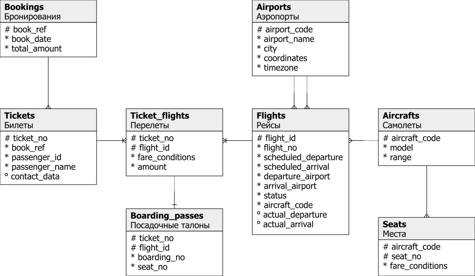

# Домашнее задание
## Секционирование таблицы
 
 Скачиваем и устанавливаем демонстрационную базу данных авиаперевозки по России.
```bash
curl https://edu.postgrespro.ru/demo-medium-20161013.zip -o demo-medium.zip
  % Total    % Received % Xferd  Average Speed   Time    Time     Time  Current
                                 Dload  Upload   Total   Spent    Left  Speed
100 61.5M  100 61.5M    0     0  5383k      0  0:00:11  0:00:11 --:--:-- 6038k

unzip demo-medium.zip
Archive:  demo-medium.zip
  inflating: demo_medium.sql

sudo -u postgres psql postgres < ~/demo_medium.sql
```

Посмотрим размер таблиц и количество строк

```sql
ALTER DATABASE demo SET search_path TO bookings, pg_catalog;

SELECT
    t.tablename AS table_name,
    c.reltuples AS num_rows,
    pg_size_pretty(pg_total_relation_size(c.oid))AS total_size,
    pg_size_pretty(pg_table_size(c.oid)) AS data_size,
    pg_size_pretty(pg_indexes_size(c.oid)) AS index_size
FROM
    pg_catalog.pg_tables AS t
    LEFT JOIN pg_catalog.pg_class AS c ON c.relname = t.tablename
WHERE
    t.schemaname ='bookings';

   table_name    |   num_rows   | total_size | data_size | index_size
-----------------+--------------+------------+-----------+------------
 ticket_flights  | 2.360335e+06 | 246 MB     | 154 MB    | 91 MB
 boarding_passes | 1.894295e+06 | 264 MB     | 109 MB    | 155 MB
 aircrafts       |            9 | 32 kB      | 16 kB     | 16 kB
 flights         |        65664 | 10192 kB   | 6688 kB   | 3504 kB
 airports        |          104 | 72 kB      | 56 kB     | 16 kB
 seats           |         1339 | 144 kB     | 96 kB     | 48 kB
 tickets         |       829071 | 134 MB     | 109 MB    | 25 MB
 bookings        |       593433 | 43 MB      | 30 MB     | 13 MB
(8 rows)
```

Анализируя данные в таблицах, напрашивается разделение по географическому признаку, например по аэропортам. 



По представленным в БД данным, трудно определить конечную цель и задачу, которую решают с ее помощью. В ней вроде бы есть все от бронирования до номера места на борту, но нет информации по компаниям, погашенным посадочным и т.д. Попробуем абстрагироваться. Самой большой по размеру и второй по количеству строк в этой БД является таблица boarding_passes. Предположим, что наша цель учет заполняемости рейса на основе выданных посадочных (информации о том, зашел ли на борт пассажир по этому посадочному нет - какая дыра в безопасности). Будем производить секционирование по flight_id (а он уже связан с номером рейса, датой рейса, авиакомпанией, аэропортом...).

Посмотрим "внутренне устройство" таблицы boarding_passes

```sql
\d boarding_passes
                  Table "bookings.boarding_passes"
   Column    |         Type         | Collation | Nullable | Default
-------------+----------------------+-----------+----------+---------
 ticket_no   | character(13)        |           | not null |
 flight_id   | integer              |           | not null |
 boarding_no | integer              |           | not null |
 seat_no     | character varying(4) |           | not null |
Indexes:
    "boarding_passes_pkey" PRIMARY KEY, btree (ticket_no, flight_id)
    "boarding_passes_flight_id_boarding_no_key" UNIQUE CONSTRAINT, btree (flight_id, boarding_no)
    "boarding_passes_flight_id_seat_no_key" UNIQUE CONSTRAINT, btree (flight_id, seat_no)
Foreign-key constraints:
    "boarding_passes_ticket_no_fkey" FOREIGN KEY (ticket_no, flight_id) REFERENCES ticket_flights(ticket_no, flight_id)
```

Оценим значения поля flight_id

```sql
SELECT min(flight_id) AS min_id, max(flight_id ) AS max_id, count(*) AS num_rows, count(DISTINCT flight_id) AS num_uniq_id FROM boarding_passes;
 min_id | max_id | num_rows | num_uniq_id
--------+--------+----------+-------------
      1 |  65662 |  1894295 |       34466
(1 row)
```

Секционировать будем по диапазону. Разобьем на пять секций, границы возьмем из статистики, чтобы было равномерное распределение.

```sql
-- Верхняя граница
SELECT array_upper(histogram_bounds,1) FROM pg_stats WHERE tablename = 'boarding_passes' AND attname = 'flight_id';
 array_upper
-------------
         101
(1 row)

SELECT h[1], h[20], h[40], h[60],h[80],h[101] FROM (SELECT (histogram_bounds::TEXT::int[]) AS h FROM pg_stats WHERE tablename = 'boarding_passes' AND attname = 'flight_id') ;
 h  |  h   |   h   |   h   |   h   |   h
----+------+-------+-------+-------+-------
 10 | 9359 | 18448 | 30432 | 50033 | 65662
(1 row)
```

```sql
CREATE TABLE boarding_passes_part (LIKE boarding_passes INCLUDING ALL) PARTITION BY RANGE (flight_id);
CREATE TABLE

CREATE TABLE boarding_passes_part_0 PARTITION OF boarding_passes_part DEFAULT;
CREATE TABLE

CREATE TABLE boarding_passes_part_1 PARTITION OF boarding_passes_part FOR VALUES FROM (1) TO (9359);
CREATE TABLE

CREATE TABLE boarding_passes_part_2 PARTITION OF boarding_passes_part FOR VALUES FROM (9360) TO (18448);
CREATE TABLE

CREATE TABLE boarding_passes_part_3 PARTITION OF boarding_passes_part FOR VALUES FROM (18449) TO (30432);
CREATE TABLE

CREATE TABLE boarding_passes_part_4 PARTITION OF boarding_passes_part FOR VALUES FROM (30433) TO (50033);
CREATE TABLE

CREATE TABLE boarding_passes_part_5 PARTITION OF boarding_passes_part FOR VALUES FROM (50034) TO (65662);
CREATE TABLE

-- Зальем данные
INSERT INTO boarding_passes_part SELECT * FROM boarding_passes;

-- Посмотрим, что получилось

SELECT
    t.tablename AS table_name,
    c.reltuples AS num_rows,
    pg_size_pretty(pg_total_relation_size(c.oid))AS total_size,
    pg_size_pretty(pg_table_size(c.oid)) AS data_size,
    pg_size_pretty(pg_indexes_size(c.oid)) AS index_size
FROM
    pg_catalog.pg_tables AS t
    LEFT JOIN pg_catalog.pg_class AS c ON c.relname = t.tablename
WHERE
    t.schemaname ='bookings'
    AND t.tablename LIKE 'boarding_passes%';
       table_name       |   num_rows   | total_size | data_size | index_size
------------------------+--------------+------------+-----------+------------
 boarding_passes        | 1.894295e+06 | 304 MB     | 109 MB    | 195 MB
 boarding_passes_part   |           -1 | 0 bytes    | 0 bytes   | 0 bytes
 boarding_passes_part_0 |          563 | 232 kB     | 64 kB     | 168 kB
 boarding_passes_part_1 |       364484 | 82 MB      | 21 MB     | 61 MB
 boarding_passes_part_2 |       385346 | 87 MB      | 22 MB     | 65 MB
 boarding_passes_part_3 |       399247 | 88 MB      | 23 MB     | 65 MB
 boarding_passes_part_4 |       361062 | 79 MB      | 21 MB     | 58 MB
 boarding_passes_part_5 |       383593 | 85 MB      | 22 MB     | 63 MB
(8 rows)

\d boarding_passes_part
          Partitioned table "bookings.boarding_passes_part"
   Column    |         Type         | Collation | Nullable | Default
-------------+----------------------+-----------+----------+---------
 ticket_no   | character(13)        |           | not null |
 flight_id   | integer              |           | not null |
 boarding_no | integer              |           | not null |
 seat_no     | character varying(4) |           | not null |
Partition key: RANGE (flight_id)
Indexes:
    "boarding_passes_part_pkey" PRIMARY KEY, btree (ticket_no, flight_id)
    "boarding_passes_part_flight_id_boarding_no_key" UNIQUE CONSTRAINT, btree (flight_id, boarding_no)
    "boarding_passes_part_flight_id_seat_no_key" UNIQUE CONSTRAINT, btree (flight_id, seat_no)

    "boarding_passes_part_flight_id_boarding_no_idx" btree (flight_id, boarding_no)
Number of partitions: 6 (Use \d+ to list them.)

Indexes:
    "boarding_passes_pkey" PRIMARY KEY, btree (ticket_no, flight_id)
    "boarding_passes_flight_id_boarding_no_key" UNIQUE CONSTRAINT, btree (flight_id, boarding_no)
    "boarding_passes_flight_id_seat_no_key" UNIQUE CONSTRAINT, btree (flight_id, seat_no)
Foreign-key constraints:
    "boarding_passes_ticket_no_fkey" FOREIGN KEY (ticket_no, flight_id) REFERENCES ticket_flights(ticket_no, flight_id)

```

Посмотрим план выполнения запроса

```sql
EXPLAIN ANALYZE
SELECT * FROM boarding_passes_part WHERE flight_id=34235;
                                                                        QUERY PLAN
-----------------------------------------------------------------------------------------------------------------------------------------------------------
 Bitmap Heap Scan on boarding_passes_part_4 boarding_passes_part  (cost=4.76..164.32 rows=44 width=25) (actual time=0.042..0.044 rows=33 loops=1)
   Recheck Cond: (flight_id = 34235)
   Heap Blocks: exact=1
   ->  Bitmap Index Scan on boarding_passes_part_4_flight_id_boarding_no_key  (cost=0.00..4.75 rows=44 width=0) (actual time=0.031..0.031 rows=33 loops=1)
         Index Cond: (flight_id = 34235)
 Planning Time: 0.178 ms
 Execution Time: 0.076 ms
(7 rows)

EXPLAIN ANALYZE
SELECT * FROM boarding_passes WHERE flight_id=34235;
                                                                     QUERY PLAN
----------------------------------------------------------------------------------------------------------------------------------------------------
 Bitmap Heap Scan on boarding_passes  (cost=5.05..307.87 rows=80 width=25) (actual time=0.045..0.047 rows=33 loops=1)
   Recheck Cond: (flight_id = 34235)
   Heap Blocks: exact=1
   ->  Bitmap Index Scan on boarding_passes_flight_id_boarding_no_key  (cost=0.00..5.03 rows=80 width=0) (actual time=0.034..0.034 rows=33 loops=1)
         Index Cond: (flight_id = 34235)
 Planning Time: 0.256 ms
 Execution Time: 0.077 ms
(7 rows)
```

План запроса учитывает секционирование у boarding_passes_part. Производительность примерно одинаковая за счет индексов.

Удалим индексы и посмотрим на результат

```sql
-- Удаляем ограничения и индексы на не секционированной таблице
ALTER TABLE boarding_passes DROP CONSTRAINT boarding_passes_flight_id_boarding_no_key;
ALTER TABLE boarding_passes DROP CONSTRAINT boarding_passes_flight_id_seat_no_key;
DROP INDEX boarding_passes_flight_id_boarding_no;

-- Удаляем ограничения и индексы на секционированной таблице
ALTER TABLE boarding_passes_part DROP CONSTRAINT boarding_passes_part_flight_id_seat_no_key;
ALTER TABLE boarding_passes_part DROP CONSTRAINT boarding_passes_part_flight_id_boarding_no_key;
DROP INDEX boarding_passes_part_flight_id_boarding_no_idx;

-- Отключим распараллеливание запросов
SET max_parallel_workers_per_gather = 0;

-- План запроса для секционированной таблицы
EXPLAIN ANALYZE
SELECT * FROM boarding_passes_part WHERE flight_id=34235;
                                                                 QUERY PLAN
---------------------------------------------------------------------------------------------------------------------------------------------
 Seq Scan on boarding_passes_part_4 boarding_passes_part  (cost=0.00..7168.28 rows=44 width=25) (actual time=19.538..22.721 rows=33 loops=1)
   Filter: (flight_id = 34235)
   Rows Removed by Filter: 361029
 Planning Time: 0.175 ms
 Execution Time: 22.748 ms
(5 rows)

-- План запроса для НЕ секционированной таблицы
EXPLAIN ANALYZE
SELECT * FROM boarding_passes WHERE flight_id=34235;
                                                    QUERY PLAN
------------------------------------------------------------------------------------------------------------------
 Seq Scan on boarding_passes  (cost=0.00..37630.69 rows=80 width=25) (actual time=78.492..91.165 rows=33 loops=1)
   Filter: (flight_id = 34235)
   Rows Removed by Filter: 1894262
 Planning Time: 0.136 ms
 Execution Time: 91.192 ms
(5 rows)
```

В случаи отсутствия индексов поиск по секционированной таблице занял 22.748мс против 91.192 по НЕ секционированной, в 4 раза.
