# Проектная работа
##  Создание и тестирование высоконагруженного отказоустойчивого кластера PostgreSQL на базе Patroni

### <a id="content">Содержание</a>
1. [Введение](#introduction)  
2. [Принцип работы Patroni](#patroni_inside)  
    2.1  [Цикл Patroni](#patroni_inside_cycle)\
    2.2  [Перевыборы мастера](#patroni_inside_elections)
3. [Выбор конфигурации кластера](#choose_cluster_config)  
4. [Установка и настройка кластера](#cluster_install)  
    4.1 [Установка Consul](#cluster_install_consul)\
    4.2 [Установка PostgreSQL](#cluster_install_postgresql)\
    4.3 [Установка Patroni](#cluster_install_patroni)\
    4.4 [Установка HAProxy](#cluster_install_haproxy)\
    4.5 [Установка KeepAlived](#cluster_install_keepalived)
5. [Тестирование](#test) 
6. [Список использованной литературы, статей, ресурсов](#ref_list) 


### <a id="introduction">1. Введение</a>
[Вернуться к содержанию](#content) 

Проектная работа выполняется на ВМ в WMware. У всех  ВМ была однотипная конфигурация: 1 процессор, 2 ядра, 4Гб ОЗУ и 20Гб SSD диска, кластер PostgreSQL 16 на Ubuntu 22.04 LTS.

Как правило, все решения по High Availability строятся на физической репликации, большинство из них строятся на потоковой репликации. В PostgreSQL из коробки присутствует физическая синхронная и асинхронная репликации. Но она не является полным решением высокой доступности, т.к. отсутствует автоматическое переключение реплики в мастер, если что-то случилось с мастером. И ко всему, накладывает существенное ограничение на равенство major версий всех нод PostgreSQL в кластере.

 Одним из современных и распространенных способов управления мастер-реплика является использование ПО Patroni.
 
***Patroni*** — это Python-приложение для создания высокодоступных PostgreSQL кластеров на основе потоковой репликации. С его помощью можно преобразовать систему из ведущего и ведомых узлов (primary — replica) в высокодоступный кластер с поддержкой автоматического контролируемого (switchover) и аварийного (failover) переключения. 

Patroni позволяет легко добавлять новые реплики в существующий кластер, поддерживает динамическое изменение конфигурации PostgreSQL одновременно на всех узлах кластера и множество других возможностей, таких как синхронная репликация, настраиваемые действия при переключении узлов, REST API, возможность запуска пользовательских команд для создания реплики вместо pg_basebackup, взаимодействие с Kubernetes и т.д.

Patroni требует развертывания дополнительного программного обеспечения для хранения информации о кластере и его настройках. В качестве данного программного компонента могут использоваться такие  DCS (distributed consistency store / распределенное согласованное хранилище) как Etcd, Consul, Zookeeper.

Patroni очень сильно зависит от DCS, хранилище должно быть постоянно доступным. В случае не доступности хранилища, Patroni перейдет в режим только чтение, поэтому на production кластерах должно быть три и больше нод DCS (нечетное количество более выгоднее, рекомендуемое - семь) см. [Таблица отказоустойчивости](#fault_tolerance_table). 

#### <a id="fault_tolerance_table">Таблица отказоустойчивости</a>
||||
|-|-|-|
|Размер кластера|Большинство|Отказоустойчивость|
|1|1|0|
|2|2|0|
|3|2|1|
|4|3|1|
|5|3|2|
|6|4|2|
|7|4|3|
|8|5|3|
|9|5|4|


### <a id="patroni_inside">2. Принцип работы Patroni</a>
[Вернуться к содержанию](#content) 

#### <a id="patroni_inside_cycle">2.1 Цикл Patroni</a>

У Patroni есть цикл обработки событий. В начале цикла демон Patroni обновляет значение ttl-ключа лидера (ttl-ключей каждого из узлов кластера) в DCS и если не требуется выполнить других действий, то засыпает. Время, на которое засыпает Patroni равно значению loop_wait (loop_wait: 10 - значение по умолчанию). По истечении этого времени демон снова просыпается и начинается новая итерация цикла.

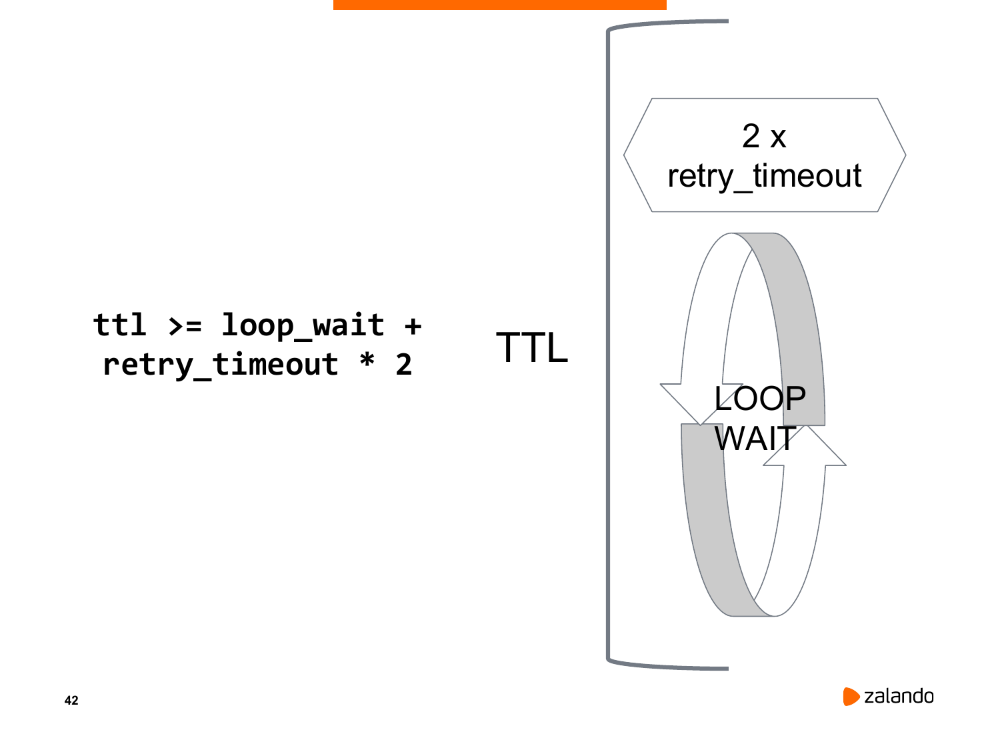

Если сервер становится недоступен или возникают ошибки в службе Patroni, то не происходит обновление значения ttl-ключа для данного узла, и так до тех пор, пока значение не достигнет 0.

В случае если истекло значение ttl-ключа узла реплики PostgreSQL, то узел исключается из кластера.

В случае если истекло значение ttl-ключа мастер узла PostgreSQL, то производятся перевыборы нового мастера из оставшихся членов кластера.

В случае если демон Patroni не видит DCS, он не мгновенно говорит «demoting», а пытается несколько раз соединиться с DCS для того, чтобы действительно убедиться, что его нет, время, которое отводится на попытки установить связь с DCS, задается параметром retry_timeout (retry_timeout: 10 - значение по умолчанию).


#### <a id="patroni_inside_elections">2.2 Перевыборы мастера</a>
[Вернуться к содержанию](#content) 

Демон на ноде текущего мастера (Primary NODE A) периодически раз в 10 секунд (loop_wait: 10 - значение по умолчанию) отправляет запрос на обновление ключа лидера в отказоустойчивый кластер DCS (на рисунке это etcd), в котором указывает, что он лидер. У ключа лидера есть ttl - это время в секундах, по истечению которого ключ пропадет (ttl: 30  - значение по умолчанию). Остальные standby-ноды периодически опрашивают кластер DCS, кто лидер.

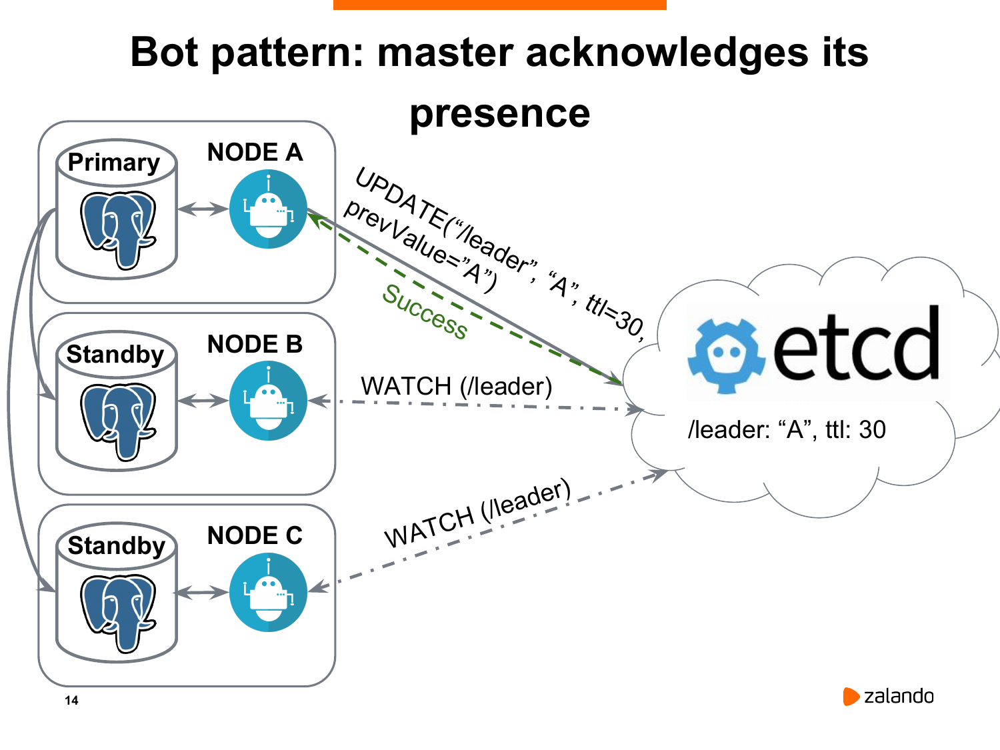

 Если что-то случилось с текущим мастером, то он не будет обновлять ключ лидера. 

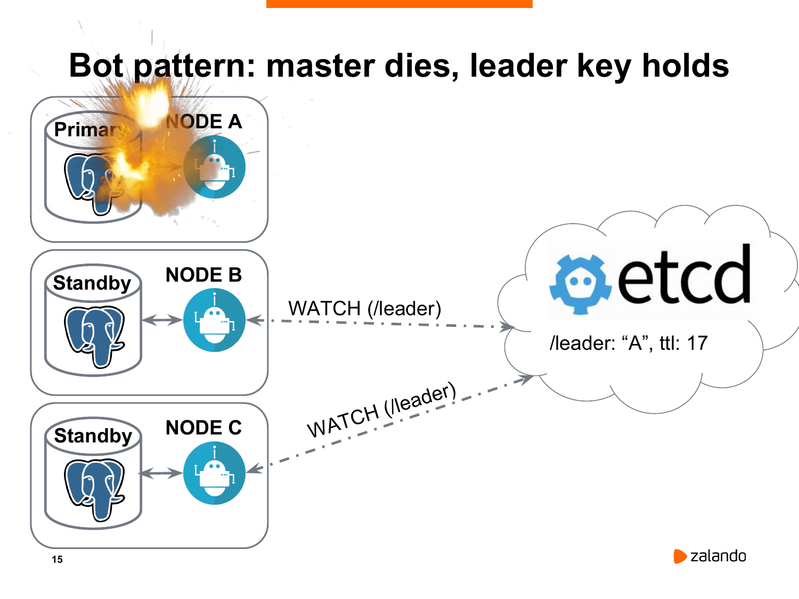

И через какое-то время (не больше ttl) время жизни ключа лидера истечет. 

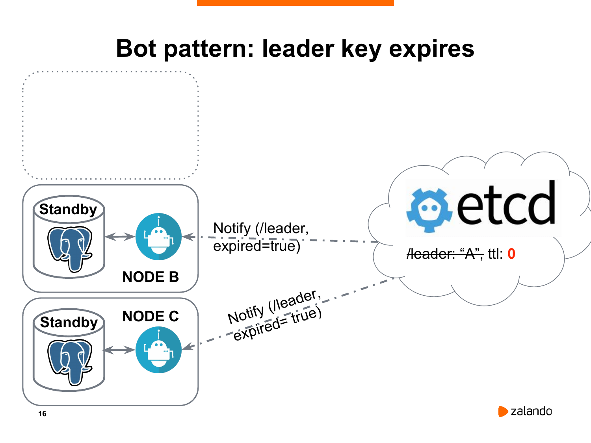

После чего, оставшиеся ноды получат оповещение о том, что лидера нет, согласно DCS. И нужно провести новые выборы.

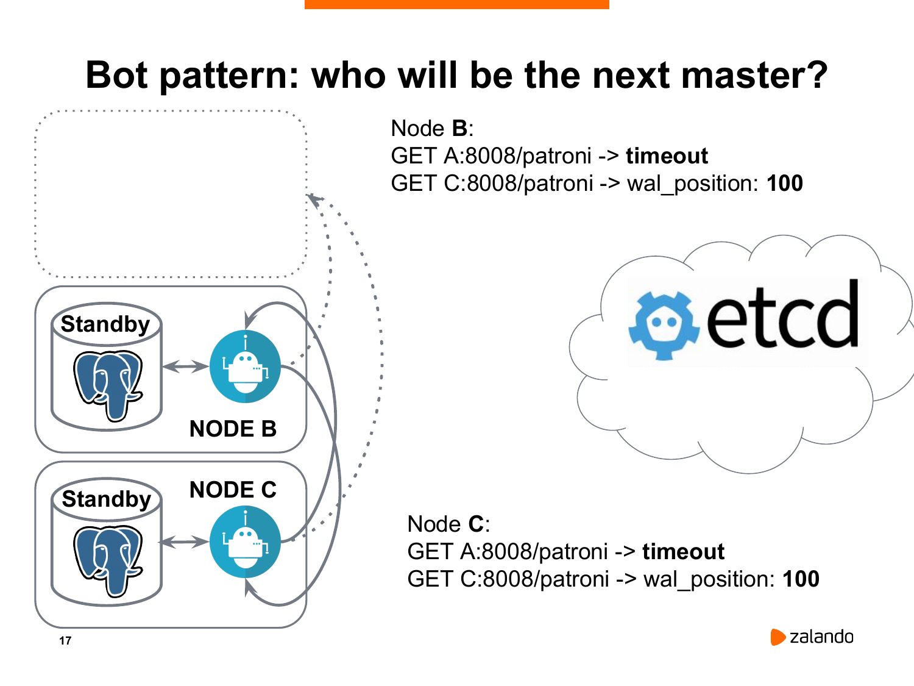

 Каждая нода обращается ко всем другим нодам, включая старый исчезнувший мастер. Потому что вдруг это были какие-то временные проблемы, и вдруг он до сих пор жив. В этом надо убедиться. Каждая нода сравнивает позицию WAL со своей. При условии, если нода является впереди всех остальных или хотя бы не отстает, как в данном случае, когда у обоих реплик оказался wal_position равный 100, то они начинают гонку за лидером. Т. е. они отправляют запрос на создание нового ключа лидера в DCS.

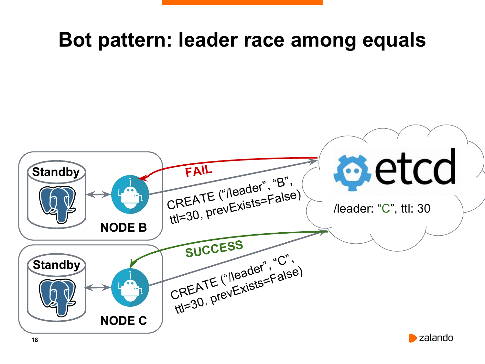

 Хранилище DCS настроено таким образом, что позволяет делать такие записи атомарно. Т.е. когда одна нода создала ключ, то вторая нода, при условии, что мы запрещаем перезаписывать уже существующий ключ, его создать не сможет.

 На следуещем рисунке нода C выиграла гонку, она успела создать ключ лидера, а нода B не смогла. 

 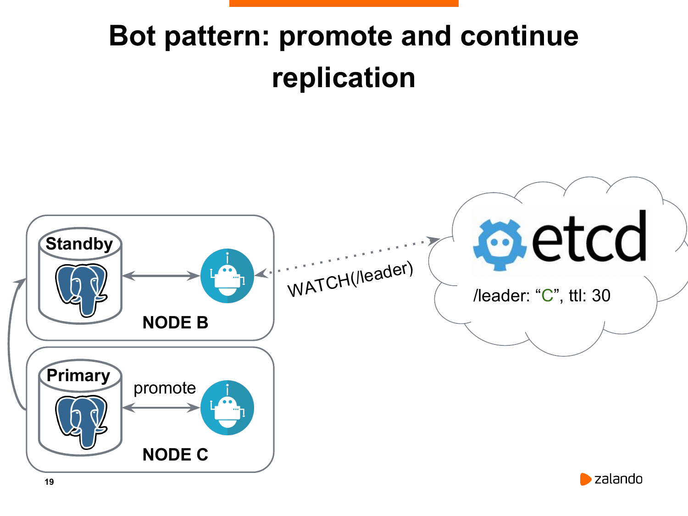

В результате, нода C становится новым мастером, она выполняет promote для Postgres. А нода B становится новой репликой, которая будет уже реплицировать не с ноды A, которая недоступна, а с ноды C. 


### <a id="choose_cluster_config">3. Выбор конфигурации кластера</a>
[Вернуться к содержанию](#content) 

Определить, является ли мастер и реплика живыми, можно при условии, что у нас есть нечетное количество нод, которые проводят голосование. 

 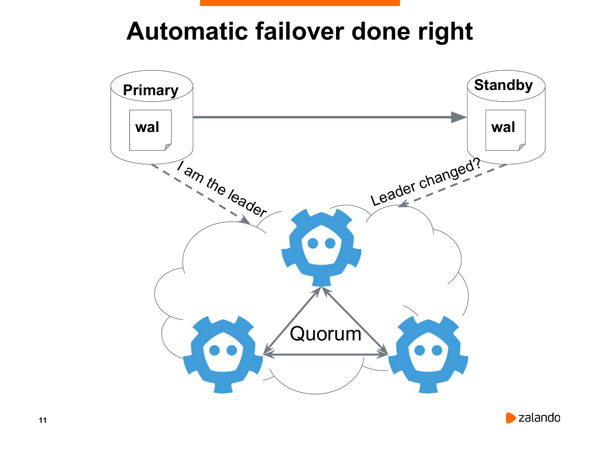

В данном случае у нас есть три ноды. Если две ноды соглашаются о том, что у нас primary недоступен, то у этих двух нод есть большинство голосов. Два из трех – это большинство. Почему не рекомендуется использовать четное количество? В принципе, в этом нет ничего страшного, но для того, чтобы получить большинство голосов из четырех нод, должны три согласиться с результатами выборов см. [Таблица отказоустойчивости](#fault_tolerance_table). 

Т.о., для построения отказоустойчивого кластера PostgreSQL на базе Patroni, будем использовать 3 ноды - минимальное из рекомендуемого (демо кластер, да и ресурсы ограничены).

В качестве DCS будем использовать Consul. Он хорошо уживается на одном хосте с PostgeSQL, в то время как у Etcd наблюдались конфликты на уровне дисковой подсистемы, при совместном размещении, а для выделения еще 3х ВМ для Etcd - нет ресурсов.

В качестве менеджера пула соединений будем использовать: PgBouncer - легковесный (2 Кб на соединение) пул соединений решает проблему PostgreSQL относительно большого количества соединений.

В качестве балансировщика нагрузки будем использовать: HAProxy - решает проблему управления трафиком при выходе из строя мастера или других каких-либо изменений в работе нод PostgreSQL.

Для обеспечения высокой доступности сервиса будем использовать: KeepAlived - единая точка подключения, решает проблему прохождения трафика разными маршрутами, обеспечивает доступность самого балансировщика нагрузки.

Схема выстраиваемого кластера:

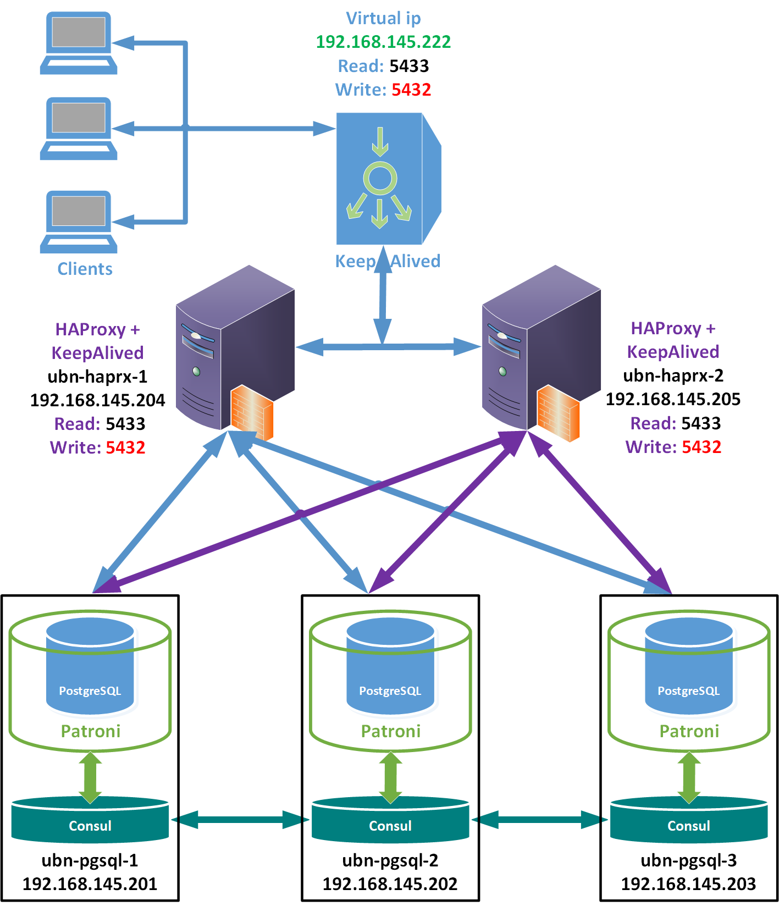


### <a id="cluster_install">4. Установка и настройка кластера</a>

[Вернуться к содержанию](#content) 

Для реализации отказоустойчивого кластера PostgreSQL на базе Patroni нам потребуется следующая инфраструктура:

|||||||||
|-|-|-|-|-|-|-|-|
| ВМ | name | ip | PostgreSQL | Patroni | Consul | HAProxy | KeepAlived |
| 1 | ubn-pgsql-1 |192.168.145.201| + Server | + | + | - | - |
| 2 | ubn-pgsql-2 |192.168.145.202| + Server | + | + | - | - |
| 3 | ubn-pgsql-3 |192.168.145.203| + Server | + | + | - | - |
| 4 | ubn-haprx-1 |192.168.145.204| - | - | - | + | + |
| 5 | ubn-haprx-2 |192.168.145.205| - | - | - | + | + |
| 6 | ubn-cli-1   |192.168.145.206| + Client | - | - | - | - |

Конфигурация PostgreSQL

||||||||
|-|-|-|-|-|-|-|
| ВМ | name | ip | ver | port | user | pswd |
| 1 | ubn-pgsql-1 |192.168.145.201| 16 | 5432 | postgres | pg1 |
| 2 | ubn-pgsql-2 |192.168.145.202| 16 | 5432 | postgres | pg1 |
| 3 | ubn-pgsql-3 |192.168.145.203| 16 | 5432 | postgres | pg1 |
| 4 | ubn-haprx-1 |192.168.145.204| - | 5432/5433 | - | - |
| 5 | ubn-haprx-2 |192.168.145.205| - | 5432/5433 | - | - |
| 6 | ubn-cli-1 |192.168.145.206| 16 | - | - | - |


#### <a id="cluster_install_consul">4.1 Установка Consul</a>

[Вернуться к содержанию](#content) 

Скачиваем дистрибутив Consul с официального сайта  [https://releases.hashicorp.com/consul/1.20.2/consul_1.20.2_linux_amd64.zip](https://releases.hashicorp.com/consul/1.20.2/consul_1.20.2_linux_amd64.zip) в общую папку _Share, подключенную к каждой ВМ в конфиге WMware.

```bash
vmware-hgfsclient
_Share
sudo vmhgfs-fuse .host:/_Share /mnt/hgfs/ -o allow_other -o uid=1000

sudo unzip /mnt/hgfs/consul_1.20.2_linux_amd64.zip -d /usr/bin/
Archive:  /mnt/hgfs/consul_1.20.2_linux_amd64.zip
  inflating: /usr/bin/LICENSE.txt
  inflating: /usr/bin/consul

# Посмотрим, что с правами на consul все хорошо
ls -la /usr/bin/consul*
-rwxr-xr-x 1 root root 177071783 Jan  3 17:38 /usr/bin/consul

# Проверяем, что приложение может запускаться на нашей системе:
consul -v
Consul v1.20.2
Revision 33e5727a
Build Date 2025-01-03T14:38:40Z
Protocol 2 spoken by default, understands 2 to 3 (agent will automatically use protocol >2 when speaking to compatible agents)

# Создаем учетную запись, от которой будет работать consul
sudo useradd -r -c 'Consul DCS service' consul

#Создаем каталоги для приложения consul и выставим на них нужные права:
sudo mkdir -p /var/lib/consul /etc/consul.d
sudo chown consul:consul /var/lib/consul /etc/consul.d
sudo chmod 775 /var/lib/consul /etc/consul.d

# Сгенерируем ключ для consul
consul keygen
x6X+9gWvYjIzh+iNTcMA9x30GFRytx9SWI8OQktEwik=
```

Создаем конфигурационный файл для Consul, он будет идентичен для всех 3х нод

```bash
sudo cat > temp.cfg << EOF 
{
    "bind_addr": "0.0.0.0",
    "bootstrap_expect": 3,
    "client_addr": "0.0.0.0",
    "data_dir": "/var/lib/consul",
    "dns_config": {
        "enable_truncate": true,
        "only_passing": true
    },
    "enable_syslog": true,
    "encrypt": "x6X+9gWvYjIzh+iNTcMA9x30GFRytx9SWI8OQktEwik=",
    "leave_on_terminate": true,
    "log_level": "INFO",
    "rejoin_after_leave": true,
    "retry_join": [
        "192.168.145.201",
        "192.168.145.202",
        "192.168.145.203"
    ],
    "server": true,
    "ui_config": { "enabled": true }
}
EOF
cat temp.cfg | sudo tee -a /etc/consul.d/config.json
```
Подробное описание параметров можно посмотреть здесь: [https://developer.hashicorp.com/consul/docs/agent/config/config-files](https://developer.hashicorp.com/consul/docs/agent/config/config-files)

- **bind_addr** — IP-адрес, на котором Consul будет слушать входящие соединения.
- **bootstrap_expect** — минимально ожидаемое количество серверов в кластере. Consul будет ждать, пока данное число серверов не станет доступным, только после этого загрузит кластер.
- **client_addr** — IP-адрес, на котором Consul будет принимать клиентские соединения.
- **data_dir** — Каталог, где Consul хранит данные.
- **enable_script_checks** — Разрешение выполнения проверки работоспособности скриптов.
- **dns_config** - Конфигурация DNS.
    - **enable_truncate** — Разрешение сокращения ответов DNS.
    - **only_passing** — Указание возвращать только узлы, которые проходят проверки работоспособности.
- **enable_syslog** — Разрешение отправки логов Consul в системный лог.
- **encrypt** — Ключ шифрования для безопасного взаимодействия между узлами Consul.
- **leave_on_terminate** — Указание Consul при получении сигнала на остановку процесса, корректно отключать ноду от кластера.
- **log_level** — Уровень детализации логов.
- **rejoin_after_leave** — Позволение узлу повторно присоединяться к кластеру после временного выхода.
- **retry_join** — Список серверов, к которым Consul будет пытаться подключаться в случае потери связи.
- **server** — Указывает, что узел является сервером (а не клиентом) в кластере.
- **start_join** — Устарел с версии 1.15 и будет удален в будущих версиях. Следует использовать retry_join. Список серверов, к которым узел пытается подключиться при запуске.
- **ui_config**:
    - **enabled** — Включает или отключает веб-интерфейс Consul.

Проверяем корректность конфигурационного файла:

```bash
consul validate /etc/consul.d
bootstrap_expect > 0: expecting 3 servers
Configuration is valid!
```

Создадим юнит в systemd для возможности автоматического запуска сервиса:

```bash
cat > temp.cfg << EOF 
[Unit]
Description=Consul Service Discovery Agent
Documentation=https://www.consul.io/
After=network-online.target
Wants=network-online.target

[Service]
Type=simple
User=consul
Group=consul
ExecStart=/usr/bin/consul agent \
    -config-dir=/etc/consul.d
ExecReload=/bin/kill -HUP $MAINPID
KillSignal=SIGINT
TimeoutStopSec=5
Restart=on-failure
SyslogIdentifier=consul

[Install]
WantedBy=multi-user.target
EOF
cat temp.cfg | sudo tee -a /etc/systemd/system/consul.service
```

Запуск consul

```bash
# Перечитываем конфигурацию systemd
sudo systemctl daemon-reload
# Стартуем наш сервис
sudo systemctl start consul
# Разрешаем автоматический старт при запуске сервера:
sudo systemctl enable consul
```

Все вышеперечисленное проделываем на всех трех нодах (за исключением генерации нового ключа, он один на всех).

Убедимся, что наше DCS хранилище, построенное на базе Consul, работает

```bash
consul members
Node         Address               Status  Type    Build   Protocol  DC   Partition  Segment
ubn-pgsql-1  192.168.145.201:8301  alive   server  1.20.2  2         dc1  default    <all>
ubn-pgsql-2  192.168.145.202:8301  alive   server  1.20.2  2         dc1  default    <all>
ubn-pgsql-3  192.168.145.203:8301  alive   server  1.20.2  2         dc1  default    <all>

systemctl status consul
```

 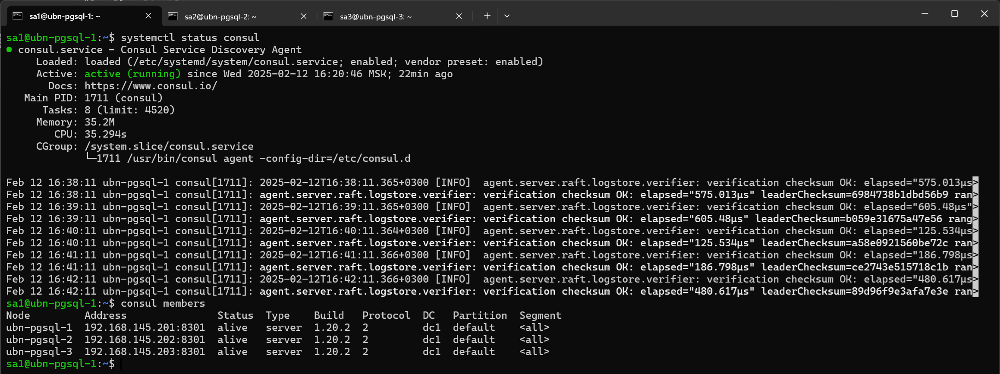

 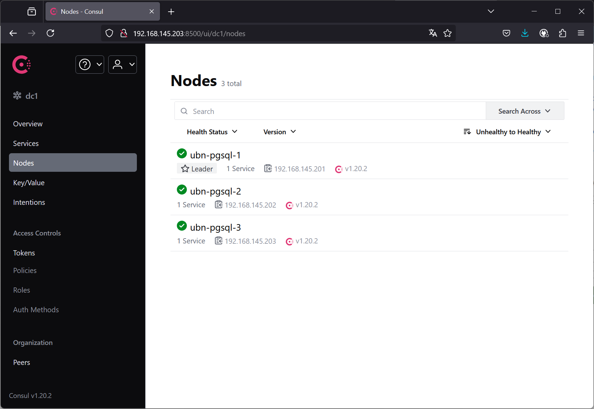

Установка и настройка DCS завершена!


#### <a id="cluster_install_postgresql">4.2 Установка PostgreSQL</a>

[Вернуться к содержанию](#content) 

Устанавливаем PostgreSQL 16. Установку будем производить из репозитория с официального сайта.

```bash
# Импортируем ключ подписи репозитория

sudo apt install curl ca-certificates
sudo install -d /usr/share/postgresql-common/pgdg
sudo curl -o /usr/share/postgresql-common/pgdg/apt.postgresql.org.asc --fail https://www.postgresql.org/media/keys/ACCC4CF8.asc

# Создаем конфигурационный файл репозитория

sudo sh -c 'echo "deb [signed-by=/usr/share/postgresql-common/pgdg/apt.postgresql.org.asc] https://apt.postgresql.org/pub/repos/apt $(lsb_release -cs)-pgdg main" > /etc/apt/sources.list.d/pgdg.list'

# Обновляем списки пакетов

sudo apt update

# Устанавливаем 16-ю версию PostgreSQL

sudo apt -y install postgresql-16
```

Проверим что установка прошла успешно и кластер запущен

```bash
sudo -u postgres pg_lsclusters
Ver Cluster Port Status Owner    Data directory              Log file
16  main    5432 online postgres /var/lib/postgresql/16/main /var/log/postgresql/postgresql-16-main.log
```

Все вышеперечисленное проделываем на всех трех нодах.


#### <a id="cluster_install_patroni">4.3 Установка Patroni</a>

[Вернуться к содержанию](#content) 

Устанавливаем Pythonn 3 с необходимыми библиотеками и Patrony для DCS Consul

```bash
# Устанавливаем python версии 3
sudo apt install -y python3 python3-pip

# Устанавливаем библиотеку для работы с postgresql python3-psycopg2.
sudo pip3 install psycopg2-binary

# Устанавливаем Patroni для DCS Consul
sudo pip3 install patroni[consul]

# Создадим каталог для хранения конфигурации Patroni:
sudo mkdir /etc/patroni

```

Чтобы не было проблем с локалью, а именно создавал кластер Patroni, он изменял локаль на en_GB и поднятие реплик валилось с ошибками типа: "invalid value for parameter "lc_monetary": "en_GB.UTF-8"", т.к. там локаль была en_US

```bash
# Создадим файлы локализации
sudo locale-gen en_US.UTF-8
```

Создаем файл настроек Patroni

```yml
host_ip=$(hostname -I | tr -d " ") &&
host_mask='192.168.145.0/24' &&
cat > patroni_tmp.cfg << EOF 
scope: patroni_pgdb
name: $(hostname)
restapi:
  listen: $host_ip:8008
  connect_address: $host_ip:8008
consul:
  host: "localhost:8500"
  register_service: true
  #token: <consul-acl-token>

# The bootstrap configuration. Works only when the cluster is not yet initialized.
# If the cluster is already initialized, all changes in the `bootstrap` section are ignored!
# Global setting for all nodes in cluster
bootstrap:
  # This section will be written into Etcd:/<namespace>/<scope>/config after initializing new cluster
  # and all other cluster members will use it as a `global configuration`.
  # WARNING! If you want to change any of the parameters that were set up
  # via `bootstrap.dcs` section, please use `patronictl edit-config`!
  dcs:
    ttl: 30
    loop_wait: 10
    retry_timeout: 10
    maximum_lag_on_failover: 1048576
    postgresql:
      use_pg_rewind: true
      #use_slots: true
      parameters:
  initdb: 
  - encoding: UTF8
  - data-checksums
  - locale: en_US.UTF-8
  pg_hba: 
  - host replication replicator $host_mask md5
  - host all all $host_mask md5
  users:
    admin:
      password: admin_321
      options:
        - createrole
        - createdb
# End bootstrap section

# Local settings. On current node only. To take affect: reload (and restart restart if necessary) Patroni
postgresql:
  # IP address + port that Postgres listens to; must be accessible from other nodes in the cluster, if you’re using streaming replication. Multiple comma-separated addresses are permitted, as long as the port component is appended after to the last one with a colon, i.e. listen: 127.0.0.1,127.0.0.2:5432. Patroni will use the first address from this list to establish local connections to the PostgreSQL node.
  listen: 127.0.0.1, $host_ip
  # IP address + port through which Postgres is accessible from other nodes and applications.
  connect_address: $host_ip:5432
  data_dir: /var/lib/postgresql/16/main
  bin_dir: /usr/lib/postgresql/16/bin
  pgpass: /tmp/pgpass0
  authentication:
    replication:
      username: replicator
      password: rep1
    superuser:
      username: postgres
      password: pg1
    rewind:  
      username: rewind_user
      password: rew1
  parameters:
    unix_socket_directories: '.'
tags:
    nofailover: false
    noloadbalance: false
    clonefrom: false
    nosync: false
EOF
cat patroni_tmp.cfg | sudo tee -a /etc/patroni/patroni.yml    
```

Подробное описание параметров можно посмотреть здесь: [https://patroni.readthedocs.io/en/latest/patroni_configuration.html](https://patroni.readthedocs.io/en/latest/patroni_configuration.html)\
[https://patroni.readthedocs.io/en/latest/yaml_configuration.html](https://patroni.readthedocs.io/en/latest/yaml_configuration.html)\
[https://patroni.readthedocs.io/en/latest/ENVIRONMENT.html#environment](https://patroni.readthedocs.io/en/latest/ENVIRONMENT.html#environment)

- **scope** — Указывает имя кластера Patroni. Все узлы кластера должны иметь одинаковое значение scope.
- **name** - Указывает уникальное имя текущего узла.
- **restapi** - Этот раздел управляет настройками REST API, используемого Patroni.
- **restapi.connect_address** — IP-адрес и порт для доступа к REST API на настраиваемом сервере, на который будут приходить подключения к patroni. 
- **restapi.listen** - IP-адрес и порт, которые Patroni будет прослушивать, чтобы предоставить информацию о проверке работоспособности HAProxy.
- **consul** - Этот раздел управляет взаимодействием Patroni с DCS Consul.
- **consul.host** - IP адрес и  порт для локального агента Consul.
- **consul.register_service** - регистрировать ли службу с именем, определяемым параметром scope и тегом master, primary, replica или standby-leader в зависимости от роли узла.
- **bootstrap** - Этот раздел отвечает за начальную инициализацию кластера. Работает только когда кластер еще не инициализирован. Если кластер уже инициализирован, все изменения в разделе `bootstrap` игнорируются!
- **bootstrap.dcs** - Глобальная динамическая конфигурация для кластера, записывается один раз после инициализации нового кластера в DCS по пути /namespace/scope/config. Для изменения параметров после инициализации кластера нужно использовать patronictl edit-config. 
  - **loop_wait** - промежуток в секундах между попытками обновить ключ лидера
  - **retry-timeout** - время, которое отводится на попытки установить связь с DCS
  - **ttl** - время жизни ключа лидера. Рекомендация: как минимум loop_wait + 2 * retry_timeout, но вообще, таким комфортным, чтобы избежать нескольких медленных/неудавшихся вызовов к DCS и при этом время переключения на другую ноду при фейловере было минимальным
  - **maximun_lag_on_failover** - максимальное отставание ноды от лидера для того, чтобы участвовать в выборах
  - **synchronous_mode** - вкл/выкл синхронной реплики
  - **synchronous_mode_strict** - вкл/выкл строго синхронного режима, чтобы основной кластер останавливался при смерти синхронной реплики
- **bootstrap.pg_hba** - Этот раздел указывает список правил для pg_hba.conf.
- **bootstrap.initdb** - Cписок параметров, которые необходимо передать в initdb.
- **postgresql** - Этот раздел определяет конфигурацию PostgreSQL
- **tags** - Этот раздел позволяет задавать особые роли для узлов

Создадим юнит в systemd для возможности автоматического запуска сервиса:

```bash
cat > patroni_unit_tmp.cfg << EOF 
[Unit]
Description=High availability PostgreSQL Cluster
After=syslog.target network.target
[Service]
Type=simple
User=postgres
Group=postgres
ExecStart=/usr/local/bin/patroni /etc/patroni/patroni.yml
KillMode=process
TimeoutSec=30
Restart=no
[Install]
WantedBy=multi-user.target
EOF
cat patroni_unit_tmp.cfg | sudo tee -a /etc/systemd/system/patroni.service
```

Перед запуском остановить и удалить кластер PostgreSQL

```bash
sudo systemctl stop postgresql@16-main

sudo -u postgres pg_dropcluster 16 main
Warning: systemd was not informed about the removed cluster yet. Operations like "service postgresql start" might fail. To fix, run:
sudo systemctl daemon-reload
```

Запуск Patroni

```bash

# Перечитываем конфигурацию systemd
sudo systemctl daemon-reload

# Разрешаем автоматический старт при запуске patroni:
sudo systemctl enable patroni
Created symlink /etc/systemd/system/multi-user.target.wants/patroni.service → /etc/systemd/system/patroni.service.

# Стартуем сервис patroni
sudo systemctl start patroni
```

Все вышеперечисленное проделываем на всех трех нодах (за исключением генерации нового ключа, он один на всех).

```bash
# Проверяем состояние кластера patroni
sudo patronictl -c /etc/patroni/patroni.yml list
2025-02-15 19:35:49,594 - WARNING - Using patroni-pgdb as consul service name instead of scope name patroni_pgdb
+ Cluster: patroni_pgdb (7471658839940361118) --------+----+-----------+
| Member      | Host            | Role    | State     | TL | Lag in MB |
+-------------+-----------------+---------+-----------+----+-----------+
| ubn-pgsql-1 | 192.168.145.201 | Leader  | running   |  1 |           |
| ubn-pgsql-2 | 192.168.145.202 | Replica | streaming |  1 |         0 |
| ubn-pgsql-3 | 192.168.145.203 | Replica | streaming |  1 |         0 |
+-------------+-----------------+---------+-----------+----+-----------+
```

Удаление кластера Patroni

```bash
# Остановить Patroni на всех нодах
sudo systemctl stop patroni.service

# Удалить базы на всех нодах
sudo rm -r /var/lib/postgresql/*

# Удалить в DCS
patronictl -c /etc/patroni.yml remove 7088634863084761990
```

Полезные команды

```bash
# Просмотр кластера
sudo patronictl -c /etc/patroni/patroni.yml list

# Изменение параметров конфигурации для всего кластера
patronictl -c /etc/patroni/patroni.yml edit-config

#Для изменения локальных параметров PostgreSQL их нужно изменить в yaml файле, после чего сделать reload и если нужно, то и restart

# Перезагрузка локальной конфигурации для одного или нескольких членов Patroni.
patronictl -c /etc/patroni/patroni.yml reload patroni_pgdb ubn-pgsql-2

# Перезапуск PostgreSQL на заданной ноде
patronictl -c /etc/patroni/patroni.yml restart patroni_pgdb ubn-pgsql-2

# Просмотр лога Patroni
tail -n 50 /var/log/syslog

# Остановка Patroni
sudo systemctl stop patroni.service

# Старт Patroni
sudo systemctl start patroni.service

# Состояние демона Patroni
systemctl status patroni

# Перестраивает резервный экземпляр Postgres, управляемый репликой-членом Patroni
patronictl -c /etc/patroni/patroni.yml reinit patroni_pgdb

# Локаль
locale

# Каталог локалей
 /usr/lib/locale

# Создать файлы локализации
sudo locale-gen en_US.UTF-8

# Документация по REST API: https://patroni.readthedocs.io/en/latest/rest_api.html

http http://192.168.145.201:8008/leader

http http://192.168.145.201:8008/replica

http http://192.168.145.202:8008/cluster

http http://192.168.145.201:8008/config

http http://192.168.145.202:8008/patroni
```


### <a id="cluster_install_haproxy">4.4 Установка HAProxy</a>

[Вернуться к содержанию](#content) 


Добавление персональный архив пакетов ppa:vbernat/haproxy-3.0 в источники программного обеспечения нашей системы. Установим последнюю версию HAProxy 3.0

```bash
# You need to enable a dedicated PPA with the following command: 
sudo apt-get install --no-install-recommends software-properties-common
sudo add-apt-repository ppa:vbernat/haproxy-3.0

# Get the latest release of HAProxy 3.0. 
sudo apt-get install haproxy=3.0.\*
```

Создаем файл настроек HAProxy на основе шаблона [https://github.com/patroni/patroni/blob/master/extras/confd/templates/haproxy.tmpl](https://github.com/patroni/patroni/blob/master/extras/confd/templates/haproxy.tmpl)

```bash
cat > haproxy_tmp.cfg << EOF 
global
	maxconn 200

defaults
    log    global
    mode    tcp
    retries 2
    timeout client 30m
    timeout connect 4s
    timeout server 30m
    timeout check 5s

listen stats
    mode http
    bind *:5000
    stats enable
    stats uri /

listen postgres_write
    bind *:5432
    option httpchk HEAD /primary
    http-check expect status 200
    default-server inter 3s fall 3 rise 2 on-marked-down shutdown-sessions
    server ubn-pgsql-1 192.168.145.201:5432 maxconn 90 check port 8008
    server ubn-pgsql-2 192.168.145.202:5432 maxconn 90 check port 8008
    server ubn-pgsql-3 192.168.145.203:5432 maxconn 90 check port 8008

listen postgres_read
    balance roundrobin
    bind *:5433
    option httpchk HEAD /replica
    http-check expect status 200    
    default-server inter 3s fall 3 rise 2 on-marked-down shutdown-sessions
    server ubn-pgsql-1 192.168.145.201:5432 maxconn 90 check port 8008
    server ubn-pgsql-2 192.168.145.202:5432 maxconn 90 check port 8008
    server ubn-pgsql-3 192.168.145.203:5432 maxconn 90 check port 8008
EOF
cat haproxy_tmp.cfg | sudo tee -a /etc/haproxy/haproxy.cfg 
```

- **global** - Содержит глобальные параметры для HAProxy, которые применяются ко всем настройкам.
  - ***maxconn*** — Указывает максимальное количество соединений, которые HAProxy может обрабатывать одновременно.


- **defaults** - Содержит параметры по умолчанию, применяемые ко всем секциям listen, если для них не указаны индивидуальные настройки.
  - ***log*** — Логи для секций
  - ***mode*** — Указывает режим работы HAProxy.
  - ***retries*** — Количество попыток подключения к серверу перед тем, как будет зафиксирована ошибка.
  - ***timeout client*** — Максимальное время ожидания активности от клиента, после чего соединение разрывается.
  - ***timeout connect*** — Максимальное время ожидания подключения к серверу.
  - ***timeout server*** — Максимальное время ожидания ответа от сервера.
  - ***timeout check*** — Максимальное время ожидания проверки работоспособности узлов.
- **listen stats** - Секция для настройки веб-интерфейса HAProxy.
  - ***mode http*** — Указывает в каком формате работает сессия (В данном конфиге HTTP).
  - ***bind *:5000*** — Интерфейс доступен на порту 5000.
  - ***stats enable*** — Включает отображение статистики.
  - ***stats uri /***  / — Указывает путь для доступа к веб-интерфейсу.


- **listen primary** - Секция для управления подключениями к основному узлу кластера PostgreSQL (primary).
  - **bind** — Указывает, что HAProxy будет слушать входящие соединения на порту 5432.
  - **option httpchk HEAD** — Проверяет состояние узлов с помощью HTTP-запроса HEAD на путь /primary: 
    - ***/primary*** - узел Patroni работает как основной с блокировкой лидера
    - ***/leader*** - узел Patroni имеет блокировку лидера, не учитывает, работает ли PostgreSQL как основной или standby_leader.
  - ***http-check expect status***  — Узел считается работоспособным, если ответ HTTP-запроса имеет код 200.
  - ***default-server inter 3s fall 3 rise 2 on-marked-down shutdown-sessions:***
      - ***inter*** — Интервал проверки состояния узла (каждые 3 секунды).
      - ***fall*** — Узел помечается как недоступный, если 3 проверки подряд завершаются неуспешно.
      - ***rise*** — Узел помечается как доступный, если 2 проверки подряд успешны.
      - ***on-marked-down shutdown-sessions*** — Отключает все существующие сессии при пометке узла как недоступного.
  - ***server ubn-pgsql-1 192.168.145.201:5432 maxconn 90 check port 8008***:
    - ***server ubn-pgsql-1 192.168.145.201:5432*** - Указывает сервер PostgreSQL ubn-pgsql-1 с адресом 92.168.145.201 и портом 5432:
    - ***maxconn*** — Максимальное количество одновременных соединений.
    - ***check port*** — Использует порт 8008 для проверки состояния узла.

Перезапустим службу после изменения настроек.

```bash
sudo systemctl restart haproxy.service

sudo systemctl status haproxy.service
```

Все вышеперечисленное проделываем на всех двух нодах: ubn-haprx-1 и ubn-haprx-2.

Убедимся что HAProxy работает

 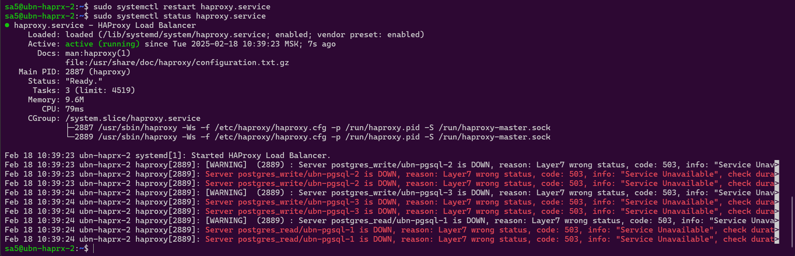

 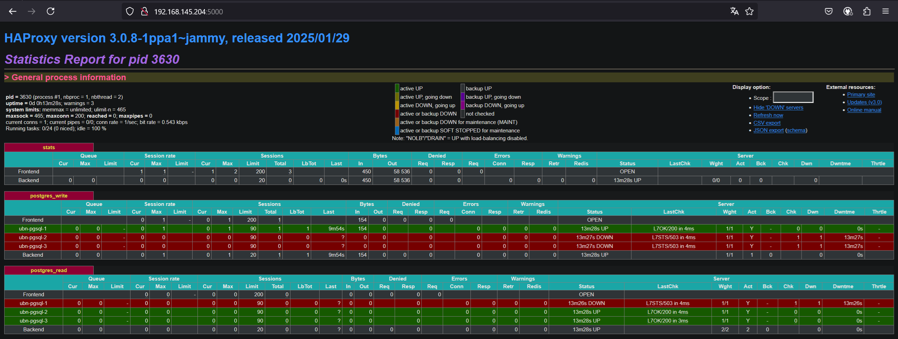

Установим клиента PostgreSQL

```bash
sudo apt update &&
sudo apt upgrade -y &&
sudo apt install -y postgresql-client-common &&
sudo apt install postgresql-client -y
```

Протестируем соединения

```sql
-- Подключаемся к реплике через HAProxy: ubn-haproxy-2 порт 5433

psql -p 5433 -d testdb -h 192.168.145.205 -U postgres
Password for user postgres:
psql (14.15 (Ubuntu 14.15-0ubuntu0.22.04.1), server 16.6 (Ubuntu 16.6-1.pgdg22.04+1))
WARNING: psql major version 14, server major version 16.
         Some psql features might not work.
Type "help" for help.

testdb=# \d
             List of relations
 Schema |    Name     |   Type   |  Owner
--------+-------------+----------+----------
 public | tbl1        | table    | postgres
 public | tbl1_id_seq | sequence | postgres
(2 rows)

testdb=# select * from tbl1;
 id |    fio
----+------------
  1 | Ivanov
  2 | Petrov
  3 | Sidorov
(3 rows)

testdb=# insert into tbl1(fio) values('Kukushkin');
ERROR:  cannot execute INSERT in a read-only transaction
testdb=# \q

-- Подключаемся к мастеру через HAProxy: ubn-haproxy-2 порт 5432

psql -p 5432 -d testdb -h 192.168.145.205 -U postgres
Password for user postgres:
psql (14.15 (Ubuntu 14.15-0ubuntu0.22.04.1), server 16.6 (Ubuntu 16.6-1.pgdg22.04+1))
WARNING: psql major version 14, server major version 16.
         Some psql features might not work.
Type "help" for help.

testdb=# \dt
        List of relations
 Schema | Name | Type  |  Owner
--------+------+-------+----------
 public | tbl1 | table | postgres
(1 row)

testdb=# insert into tbl1(fio) values('Kukushkin');
INSERT 0 1
testdb=# select * from tbl1;
 id |    fio
----+------------
  1 | Ivanov
  2 | Petrov
  3 | Sidorov
  4 | Kukushkin
(4 rows)

testdb=# \q
```


#### <a id="cluster_install_keepalived">4.5 Установка KeepAlived</a>

[Вернуться к содержанию](#content) 

Keepalived выполняет две основные функции:
- Проверка работоспособности систем LVS (Linux Virtual Server);
- Реализация стека VRRPv2 (Virtual Redundancy Routing Protocol) для обработки отказоустойчивости балансировщика нагрузки.

Установка
```bash
sudo apt-get install keepalived
```

Для балансировки нагрузки нужен виртуальный ip-адрес, к которому будет привязан балансировщик в случае аварийного переключения.

Включим параметры ядра:
- **net.ipv4.ip_nonlocal_bind** - Установка этой переменной позволяет отдельным локальным процессам выступать от имени внешнего (чужого) IP адреса. Это может оказаться полезным в некоторых случаях, когда необходимо прослушивать внешние (чужие) IP адреса, например  сниффинг чужого траффика. Однако, эта опция может оказывать отрицательное влияние на работоспособность отдельных приложений. Эта переменная может иметь два значения  0 или 1. Если установлено значение 0, то опция отключена, 1  включена. Значение по-умолчанию  0.
```bash
cat > sysctl_tmp.cfg << EOF 
net.ipv4.ip_nonlocal_bind=1
EOF
cat sysctl_tmp.cfg | sudo tee -a /etc/sysctl.conf 
```

Применим новые параметры ядра
```bash
sudo sysctl -p
```
Проверим, включено ли нелокальное связывание:
```bash
/usr/sbin/sysctl net.ipv4.ip_nonlocal_bind
net.ipv4.ip_nonlocal_bind = 1
```

Определяем интерфейс на который будем добавлять виртуальный ip адрес.
```bash
ip a
1: lo: <LOOPBACK,UP,LOWER_UP>...
...
2: ens33: <BROADCAST, ...
...
```

Все вышеперечисленное проделываем на всех двух нодах: ubn-haprx-1 и ubn-haprx-2.

Будем использовать виртуальный ip-адрес 192.168.145.222 на интерфейсах ens33. Для этого, нужно внести изменения в настройки KeepAlived.

Настройки для ubn-haprx-1:
```bash
cat > keepalived_tmp.cfg << EOF 
global_defs {
  # Keepalived process identifier
  lvs_id haproxy_DH
}
# Script used to check if HAProxy is running
vrrp_script check_haproxy {
  script "killall -0 haproxy"
  interval 2
  weight 2
}
# Virtual interface
# The priority specifies the order in which the assigned interface to take over in a failover
vrrp_instance VI_01 {
  state MASTER
  interface ens33
  virtual_router_id 51
  priority 101
  # The virtual ip address shared between the two loadbalancers
  virtual_ipaddress {
    192.168.145.222
  }
  track_script {
    check_haproxy
  }
}
EOF
cat keepalived_tmp.cfg | sudo tee -a /etc/keepalived/keepalived.conf
```

Настройки для ubn-haprx-2:
```bash
cat > keepalived_tmp.cfg << EOF 
global_defs {
  # Keepalived process identifier
  lvs_id haproxy_DH_passive
}
# Script used to check if HAProxy is running
vrrp_script check_haproxy {
  script "killall -0 haproxy"
  interval 2
  weight 2
}
# Virtual interface
# The priority specifies the order in which the assigned interface to take over in a failover
vrrp_instance VI_01 {
  state BACKUP
  interface ens33
  virtual_router_id 51
  priority 100
  # The virtual ip address shared between the two loadbalancers
  virtual_ipaddress {
    192.168.145.222
  }
  track_script {
    check_haproxy
  }
}
EOF
cat keepalived_tmp.cfg | sudo tee -a /etc/keepalived/keepalived.conf
```

Стартуем сервис KeepAlived

```bash
sudo service keepalived start
```

Убедимся, что сервис запустился.

```bash
# На ubn-haprx-1
ip a
...
2: ens33: <BROADCAST,MULTICAST,UP,LOWER_UP> mtu 1500 qdisc fq_codel state UP group default qlen 1000
    link/ether 00:0c:29:81:8f:fc brd ff:ff:ff:ff:ff:ff
    altname enp2s1
    inet 192.168.145.204/24 brd 192.168.145.255 scope global ens33
       valid_lft forever preferred_lft forever
    inet 192.168.145.222/32 scope global ens33
       valid_lft forever preferred_lft forever

# На ubn-haprx-2
ip a
...
2: ens33: <BROADCAST,MULTICAST,UP,LOWER_UP> mtu 1500 qdisc fq_codel state UP group default qlen 1000
    link/ether 00:0c:29:da:79:f1 brd ff:ff:ff:ff:ff:ff
    altname enp2s1
    inet 192.168.145.205/24 brd 192.168.145.25

# Остановим KeepAlived на ubn-haprx-1 (он MASTER)
sudo service keepalived stop

# Виртуального ip адреса больше нет на ubn-haprx-1 (он MASTER)
ip a
...
2: ens33: <BROADCAST,MULTICAST,UP,LOWER_UP> mtu 1500 qdisc fq_codel state UP group default qlen 1000
    link/ether 00:0c:29:81:8f:fc brd ff:ff:ff:ff:ff:ff
    altname enp2s1
    inet 192.168.145.204/24 brd 192.168.145.255 scope global ens33
       valid_lft forever preferred_lft forever

# Виртуального ip адреса поднялся на ubn-haprx-2 (он BACKUP)
ip a
...
2: ens33: <BROADCAST,MULTICAST,UP,LOWER_UP> mtu 1500 qdisc fq_codel state UP group default qlen 1000
    link/ether 00:0c:29:da:79:f1 brd ff:ff:ff:ff:ff:ff
    altname enp2s1
    inet 192.168.145.205/24 brd 192.168.145.255 scope global ens33
       valid_lft forever preferred_lft forever
    inet 192.168.145.222/32 scope global ens33

# Запустим KeepAlived на ubn-haprx-1 (он MASTER)
sudo service keepalived start

# Виртуальный ip-адрес вернулся на MASTER ubn-haprx-1 (он MASTER)
...
2: ens33: <BROADCAST,MULTICAST,UP,LOWER_UP> mtu 1500 qdisc fq_codel state UP group default qlen 1000
    link/ether 00:0c:29:81:8f:fc brd ff:ff:ff:ff:ff:ff
    altname enp2s1
    inet 192.168.145.204/24 brd 192.168.145.255 scope global ens33
       valid_lft forever preferred_lft forever
    inet 192.168.145.222/32 scope global ens33
       valid_lft forever preferred_lft forever

# Виртуального ip адреса больше нет на ubn-haprx-2 (он BACKUP)
ip a
...
2: ens33: <BROADCAST,MULTICAST,UP,LOWER_UP> mtu 1500 qdisc fq_codel state UP group default qlen 1000
    link/ether 00:0c:29:da:79:f1 brd ff:ff:ff:ff:ff:ff
    altname enp2s1
    inet 192.168.145.205/24 brd 192.168.145.255 scope global ens33
       valid_lft forever preferred_lft forever
```

KeepAlived работает


### <a id="test">5. Тестирование</a>

[Вернуться к содержанию](#content) 

Протестируем работу кластера.

Параметры pgbench:
||||
|-|-|-|
|`-S`|--select-only|Запустить встроенный скрипт select-only (только выборка). Краткий вариант записи -b select-only.|
|-n|--no-vacuum|Не выполнять очистку после инициализации.|
|`-c клиенты`|--client=клиенты|Число имитируемых клиентов, то есть число одновременных сеансов базы данных. Значение по умолчанию — 1.|
|`-j потоки`|--jobs=потоки|Число рабочих потоков в pgbench. Использовать нескольких потоков может быть полезно на многопроцессорных компьютерах. Клиенты распределяются по доступным потокам равномерно, насколько это возможно. Значение по умолчанию — 1.|
|`-T секунды`|--time=секунды|Выполнять тест с ограничением по времени (в секундах), а не по числу транзакций для каждого клиента.|
|`-P секунды`|--progress=сек|Выводить отчёт о прогрессе через заданное число секунд (сек). Выдаваемый отчёт включает время, прошедшее с момента запуска, скорость (в TPS) с момента предыдущего отчёта, а также среднее время ожидания транзакций, стандартное отклонение и количество неуспешных транзакций с момента последнего отчёта.|
|`-h компьютер`|--host=компьютер|Адрес сервера баз данных|
|`-p порт`|--port=порт|Номер порта сервера баз данных|
|`-U имя-пользователя`|--username=имя-пользователя|Имя пользователя для подключения|
||||


Дадим тестовую нагрузку c хоста клиента ubn-cli-1 на кластер при помощи утилиты pgbench.IP адрес кластера 192.168.145.222, порт для записи 5432, для чтения 5433. Во время тестирования остановим HAproxy на мастер ноде ubn-haprx-1, так же произведем остановку Patroni на мастере ubn-pgsql-1:

```bash
# Проинициализируем тестовые таблицы pgbench с коэффициентом масштаба 100
pgbench -i -s 100 -h 192.168.145.222 -p 5432 -d testdb -U postgres

# Клиент, хост: ubn-cli-1, Сессия № 1, Нагрузка на чтение-запись
pgbench        -c  50 -j 2 -T 120 -P 5 -h 192.168.145.222 -p 5432 -U postgres testdb

# Клиент, хост: ubn-cli-1, Сессия № 2, Нагрузка только на чтение
pgbench  -S -n -c 150 -j 2 -T 120 -P 5 -h 192.168.145.222 -p 5433 -U postgres testdb 

# HAProxy & KeepAlived MASTER: ubn-haprx-1
ip a
...
2: ens33: <BROADCAST,MULTICAST,UP,LOWER_UP> mtu 1500 qdisc fq_codel state UP group default qlen 1000
    link/ether 00:0c:29:81:8f:fc brd ff:ff:ff:ff:ff:ff
    altname enp2s1
    inet 192.168.145.204/24 brd 192.168.145.255 scope global ens33
       valid_lft forever preferred_lft forever
    inet 192.168.145.222/32 scope global ens33
       valid_lft forever preferred_lft forever

sudo systemctl stop haproxy.service

ip a
...
2: ens33: <BROADCAST,MULTICAST,UP,LOWER_UP> mtu 1500 qdisc fq_codel state UP group default qlen 1000
    link/ether 00:0c:29:81:8f:fc brd ff:ff:ff:ff:ff:ff
    altname enp2s1
    inet 192.168.145.204/24 brd 192.168.145.255 scope global ens33
       valid_lft forever preferred_lft forever

# HAProxy & KeepAlived BACKUP: ubn-haprx-2
ip a
...
2: ens33: <BROADCAST,MULTICAST,UP,LOWER_UP> mtu 1500 qdisc fq_codel state UP group default qlen 1000
    link/ether 00:0c:29:da:79:f1 brd ff:ff:ff:ff:ff:ff
    altname enp2s1
    inet 192.168.145.205/24 brd 192.168.145.255 scope global ens33
       valid_lft forever preferred_lft forever
    inet 192.168.145.222/32 scope global ens33

# Patroni master: ubn-pgsql-1
sudo patronictl -c /etc/patroni/patroni.yml list
sudo systemctl stop patroni
sudo patronictl -c /etc/patroni/patroni.yml list

```
На этом эксперимент закончился, т.к. pgbench из-за обрыва коннекта.

Исключим из эксперимента отказ HAProxy
```bash
# Проинициализируем тестовые таблицы pgbench с коэффициентом масштаба 100
pgbench -i -s 100 -h 192.168.145.222 -p 5432 -d testdb -U postgres

# Клиент, хост: ubn-cli-1, Сессия № 1, Нагрузка на чтение-запись
pgbench        -c  50 -j 2 -T 120 -P 5 -h 192.168.145.222 -p 5432 -U postgres testdb

# Клиент, хост: ubn-cli-1, Сессия № 2, Нагрузка только на чтение
pgbench  -S -n -c 150 -j 2 -T 120 -P 5 -h 192.168.145.222 -p 5433 -U postgres testdb 

```
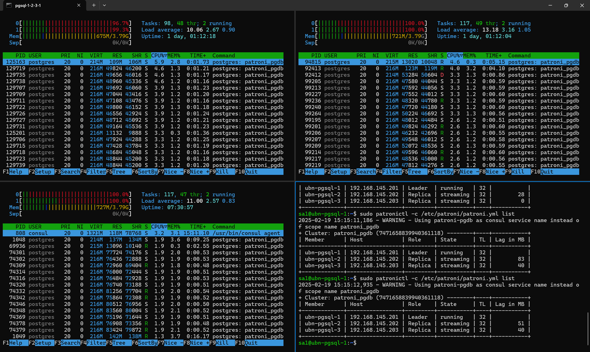

Остановим мастер ноду Patroni

```bash
# Patroni master: ubn-pgsql-1
sudo patronictl -c /etc/patroni/patroni.yml list
sudo systemctl stop patroni
sudo patronictl -c /etc/patroni/patroni.yml list
```

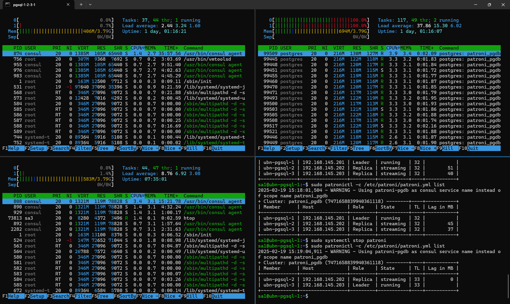

И опять эксперимент закончился, т.к. pgbench из-за обрыва коннекта.

Запустим Patroni на 1ой ноде.\
Уменьшим число коннектов на 5 и 10 соответственно.\
Повторим эксперимент.\

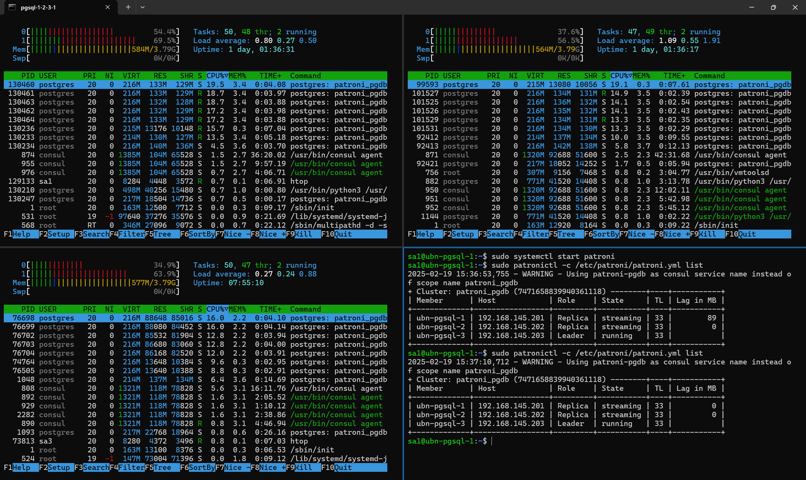

Эксперимент с нагрузкой на запись завершился ошибкой из-за обрыва коннекта, связанного со сменой мастера, а с нагрузкой на чтение доделался до конца, хотя соединения некоторых клиентов также оборвались из-за смены роли с реплики на мастер.

```bash
# Тест на запись
pgbench        -c  5 -j 2 -T 120 -P 5 -h 192.168.145.222 -p 5432 -U postgres testdb
Password:
pgbench (16.7 (Ubuntu 16.7-1.pgdg22.04+1), server 16.6 (Ubuntu 16.6-1.pgdg22.04+1))
starting vacuum...end.
progress: 5.0 s, 347.5 tps, lat 14.233 ms stddev 3.791, 0 failed
progress: 10.0 s, 292.6 tps, lat 17.080 ms stddev 6.380, 0 failed
progress: 15.0 s, 304.2 tps, lat 16.418 ms stddev 6.321, 0 failed
pgbench: error: client 4 script 0 aborted in command 4 query 0: FATAL:  terminating connection due to administrator command
server closed the connection unexpectedly
        This probably means the server terminated abnormally
        before or while processing the request.
pgbench: error: client 2 script 0 aborted in command 6 query 0: FATAL:  terminating connection due to administrator command
server closed the connection unexpectedly
        This probably means the server terminated abnormally
        before or while processing the request.
pgbench: error: client 1 script 0 aborted in command 5 query 0: FATAL:  terminating connection due to administrator command
server closed the connection unexpectedly
        This probably means the server terminated abnormally
        before or while processing the request.
pgbench: error: client 3 script 0 aborted in command 9 query 0: FATAL:  terminating connection due to administrator command
server closed the connection unexpectedly
        This probably means the server terminated abnormally
        before or while processing the request.
pgbench: error: client 0 script 0 aborted in command 9 query 0: FATAL:  terminating connection due to administrator command
server closed the connection unexpectedly
        This probably means the server terminated abnormally
        before or while processing the request.
transaction type: <builtin: TPC-B (sort of)>
scaling factor: 100
query mode: simple
number of clients: 5
number of threads: 2
maximum number of tries: 1
duration: 120 s
number of transactions actually processed: 4969
number of failed transactions: 0 (0.000%)
latency average = 15.886 ms
latency stddev = 5.741 ms
initial connection time = 41.695 ms
tps = 313.879004 (without initial connection time)
pgbench: error: Run was aborted; the above results are incomplete.
```

```bash
# Тест на чтение
pgbench  -S -n -c 10 -j 2 -T 120 -P 5 -h 192.168.145.222 -p 5433 -U postgres testdb
Password:
pgbench (16.7 (Ubuntu 16.7-1.pgdg22.04+1), server 16.6 (Ubuntu 16.6-1.pgdg22.04+1))
progress: 5.0 s, 4044.1 tps, lat 2.390 ms stddev 1.251, 0 failed
progress: 10.0 s, 4130.3 tps, lat 2.384 ms stddev 1.285, 0 failed
progress: 15.0 s, 4860.7 tps, lat 2.024 ms stddev 0.947, 0 failed
progress: 20.0 s, 5137.7 tps, lat 1.916 ms stddev 1.028, 0 failed
pgbench: error: client 8 aborted in command 1 (SQL) of script 0; perhaps the backend died while processing
pgbench: error: client 6 aborted in command 1 (SQL) of script 0; perhaps the backend died while processing
pgbench: error: client 7 aborted in command 1 (SQL) of script 0; perhaps the backend died while processing
pgbench: error: client 9 aborted in command 1 (SQL) of script 0; perhaps the backend died while processing
pgbench: error: client 0 aborted in command 1 (SQL) of script 0; perhaps the backend died while processing
progress: 25.0 s, 1641.6 tps, lat 1.880 ms stddev 0.819, 0 failed
progress: 30.0 s, 2133.6 tps, lat 4.417 ms stddev 107.172, 0 failed
progress: 35.0 s, 2619.0 tps, lat 1.892 ms stddev 0.810, 0 failed
progress: 40.0 s, 2562.8 tps, lat 1.933 ms stddev 0.923, 0 failed
progress: 45.0 s, 2714.0 tps, lat 1.824 ms stddev 0.703, 0 failed
progress: 50.0 s, 2658.6 tps, lat 1.862 ms stddev 0.771, 0 failed
progress: 55.0 s, 2762.8 tps, lat 1.790 ms stddev 0.690, 0 failed
progress: 60.0 s, 2761.3 tps, lat 1.792 ms stddev 0.684, 0 failed
progress: 65.0 s, 2783.4 tps, lat 1.779 ms stddev 0.678, 0 failed
progress: 70.0 s, 2793.5 tps, lat 1.771 ms stddev 0.654, 0 failed
progress: 75.0 s, 2773.9 tps, lat 1.786 ms stddev 0.679, 0 failed
progress: 80.0 s, 2797.6 tps, lat 1.769 ms stddev 0.642, 0 failed
progress: 85.0 s, 2791.9 tps, lat 1.773 ms stddev 0.674, 0 failed
progress: 90.0 s, 2748.1 tps, lat 1.800 ms stddev 0.791, 0 failed
progress: 95.0 s, 2648.9 tps, lat 1.870 ms stddev 0.733, 0 failed
progress: 100.0 s, 2616.9 tps, lat 1.892 ms stddev 0.706, 0 failed
progress: 105.0 s, 2495.4 tps, lat 1.985 ms stddev 0.770, 0 failed
progress: 110.0 s, 2538.1 tps, lat 1.949 ms stddev 0.736, 0 failed
progress: 115.0 s, 2517.8 tps, lat 1.966 ms stddev 0.736, 0 failed
progress: 120.0 s, 2633.4 tps, lat 1.880 ms stddev 0.715, 0 failed
transaction type: <builtin: select only>
scaling factor: 100
query mode: simple
number of clients: 10
number of threads: 2
maximum number of tries: 1
duration: 120 s
number of transactions actually processed: 350829
number of failed transactions: 0 (0.000%)
latency average = 2.007 ms
latency stddev = 18.708 ms
initial connection time = 94.139 ms
tps = 2925.799900 (without initial connection time)
pgbench: error: Run was aborted; the above results are incomplete.
```

Вывод: Нужно ставить пулер соединений между HAProxy и Patroni/PostgreSQL


### <a id="ref_list">6. Список использованной литературы, статей, ресурсов</a>

[Вернуться к содержанию](#content) 

- PostgreSQL 16 изнутри. — М.: ДМК Пресс, 2024. — 664 с. ISBN 978-5-93700-305-8
- Аристов Евгений. PostgreSQL 14. Оптимизация, Kubernetes, кластера, облака. - М.: ООО «Сам Полиграфист», 2022. - 576 с. ISBN 978-5-00166-569-4
- Аристов Евгений. PostgreSQL 16: лучшие практики оптимизации. – М.: ООО «Сам Полиграфист», 2024. – 316 с. ISBN 978-5-00227-223-5
- [Документация к PostgreSQL 16.6, Компания «Постгрес Профессиональный»](https://postgrespro.ru/docs/postgresql/16/index)
- [Patroni 4.0.4 Documentation](https://patroni.readthedocs.io/en/latest/)
- [Patroni: A Template for PostgreSQL HA with ZooKeeper, etcd or Consul](https://github.com/patroni/patroni)
- [Управление высокодоступными PostgreSQL кластерами с помощью Patroni. А.Клюкин, А.Кукушкин](https://habr.com/ru/articles/504044/)
- [HAProxy Documentation](http://docs.haproxy.org/)
- [KeepAlived user guide](https://keepalived.readthedocs.io/en/latest/index.html)

- [Consul Documentation](https://developer.hashicorp.com/consul/docs)
- [Consul GitHub](https://github.com/hashicorp/consul)


[Вернуться к содержанию](#content) 

